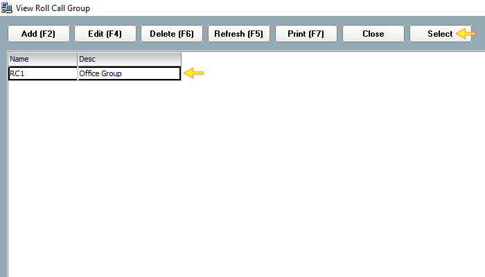

# How to configure Access Group

## List of Steps

#### STEP 1: Proceed to ‘Control Panel Tab’ and click ‘Access Group’.

#### STEP 2: Click ‘Add \(F2\)’.

#### STEP 3: Provide a name and description for the Access Group that is to be created.

#### STEP 4: Proceed to the ‘Door’ section and highlight the doors that you would like to add into the list. Click ‘Add’. Please note that a default Time Zone of 1 – 24 Hours Active.

#### STEP 5: Click ‘Save and Close’.

STEP 6: A warning prompt will appear highlight whether to Assign this Access Group to all cards. 

* If Yes: The newly created Access Group will be automatically be assigned to all card holders \(staff\).
* If No: The newly created Access Group would have to be manually allocated to the relevant card holder \(staff\). 

#### STEP 7 & COMPLETE: A new Access Group will appear from the list.

