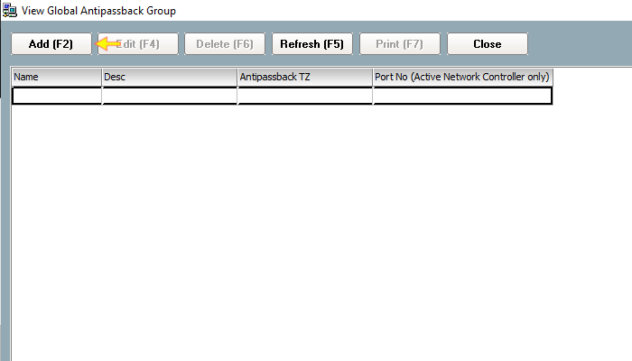
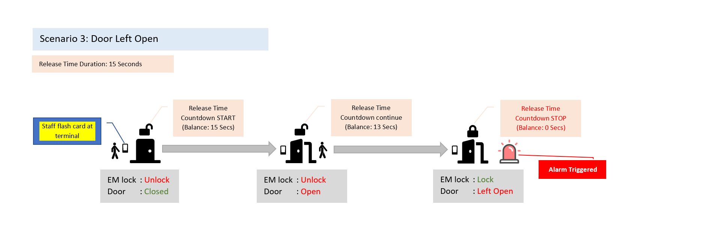

# How to configure Access Level

## List of Steps

#### STEP 1: Proceed to ‘Control Panel Tab’ and click ‘Access Level’.

#### STEP 2: Click ‘Add \(F2\)’.

#### STEP 3: Provide a description for the Access Level that is to be created.

#### STEP 4: Proceed to the ‘Door’ section and highlight the doors that you would like to add into the list. Click ‘Add’. Please note that a default Time Zone of 1 – 24 Hours Active.

#### STEP 5: Click ‘Save and Close’. 

#### STEP 6 & COMPLETE: After clicking Save and Close, you will be able to see a new Access Level appearing on the list. 

