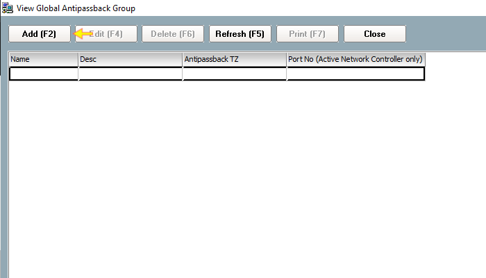
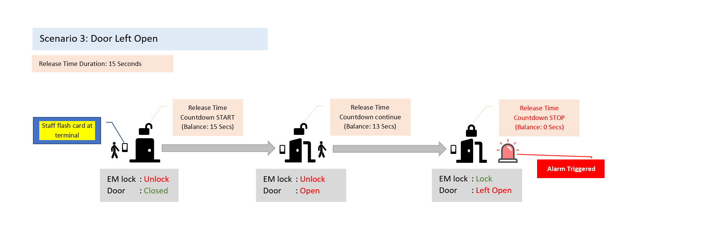
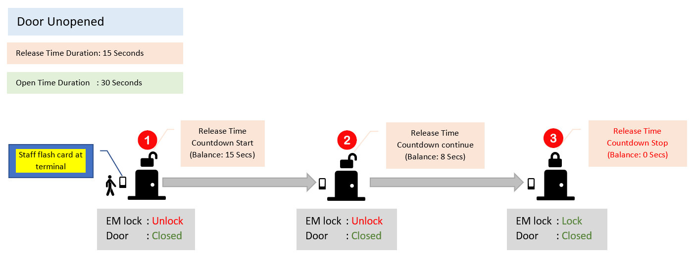

# How to configure Buddy Mode

## List of Steps

#### STEP 1: Proceed to ‘Control Panel’ Tab and click on ‘Company’. Proceed to click ‘Staff’.

#### STEP 2: List the name of the staff either through Filter View or Classic View. Once the list is listed out, select the FIRST staff that you would like to enable Buddy Mode. Next, double click on the list.

#### STEP 3: On the staff card, proceed to ‘Card Data’. On the list of allocated Access Card, double click on the card which you would like to enable the Buddy Mode.

#### STEP 4: On the Buddy Mode checkbox, tick Yes. Proceed to allocate a 'Buddy No.' for the staff. Click ‘Accept’.

#### STEP 5: For the 2nd and subsequent that is to be paired to the 1st staff, repeat STEP 2 to STEP 5. Please note that to staffs that is required to be within the same buddy group, _**they must have the same 'buddy no'.**_

_\*\*\*\*_

#### STEP 6: Return to Control Panel and proceed to ‘System’. Click ‘Controller’.

#### STEP 7: Select the Control Panel that you would like to enable the Buddy Mode. Click ‘Edit \(F4\)’.

#### STEP 8: Proceed to ‘Door Setting’ and scroll to ‘Buddy Mode Time Zone’. Choose the door that you would like to enable this Buddy Mode feature. Click on ‘0 – Not Active’ link.

#### STEP 9: Proceed to choose a Time Zone for this feature and click ‘Select’.

#### STEP 10 & COMPLETE: Proceed to click ‘Accept’ and the Buddy Mode feature will be enabled for that particular door.

## Quick Note

It is important to note that Buddy Mode numbers will range from 1- 255. For a Buddy Mode user, it is possible to allocate multiple users to them as buddies so as to increase the versatility of accessing a place without having to rely on a single designated individual.

