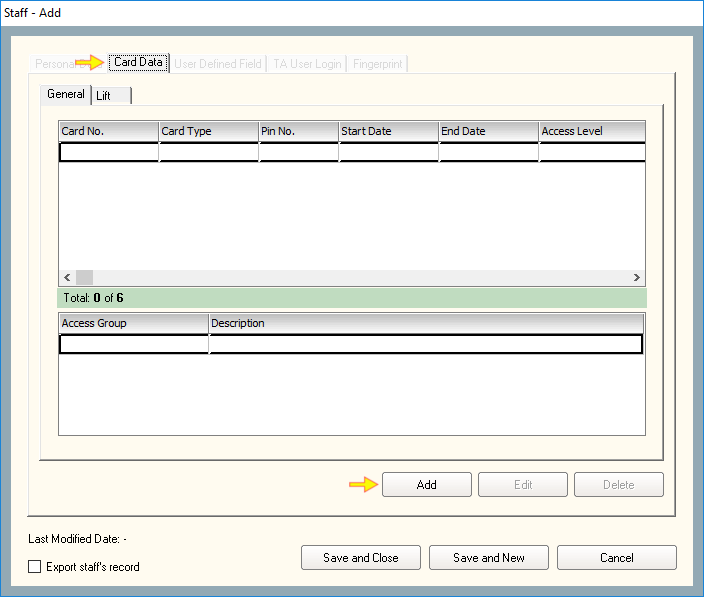
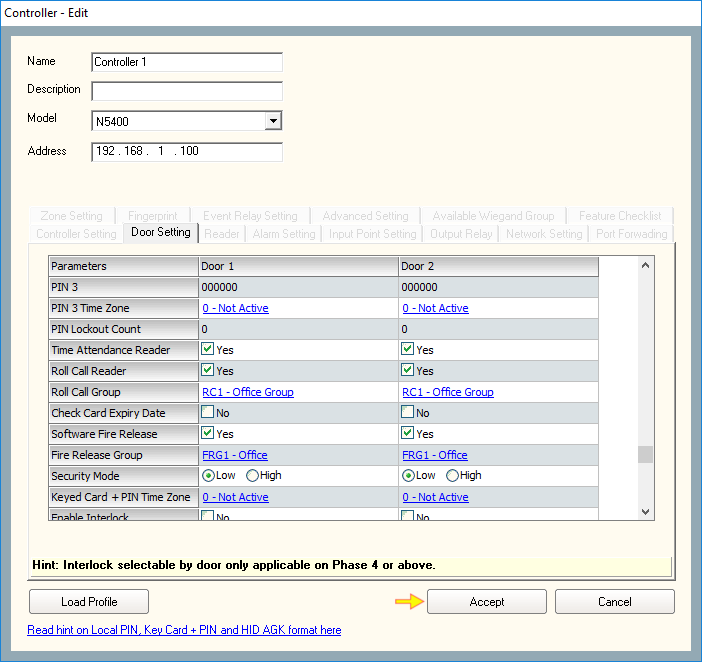
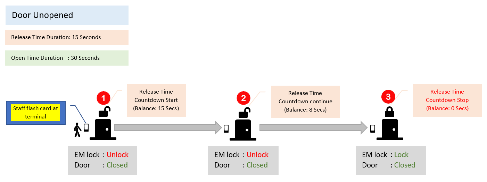

# How to configure Cross Board Interlock

## List of Steps

#### STEP 1: Before commencing, please complete the process for 'How to configure Single Board Interlock Feature'. Once complete, proceed to STEP 2.



#### STEP 2: Proceed to ‘Control Panel Tab’ and click on ‘System’ to continue. Next, click 'Interlock Group'.

#### STEP 3: Click ‘Add \(F2\)’.

#### STEP 4: Provide a Name and Description of the Interlock Group that is to be created. Press ‘Save and Close’ when complete.

#### STEP 5: Return to ‘Control Panel’ Tab. Click ‘Controller’.

#### STEP 6: Choose the Control Panel that you would like to add into the Interlock Group \(refer to Quick Note 1\).

#### STEP 7: Click ‘Cross board Interlock Group’ on ‘Undefined’ link.

#### STEP 8: Select the group that you would like to add the Control Panel into. Once the group is selected, click ‘Select’.

#### STEP 9: Proceed to ‘Input Point Setting’.

#### STEP 10: Select an input \(those which had not been occupied\) and proceed to ‘Type’ column.

#### STEP 11: Click on the chosen row and select option '8 - Inerlock'. The system will automatically allocate a name to this input point.

#### STEP 13: Proceed to Output Relay Tab. On the row indicating ‘Interlock’, tick a checkbox that the checkbox on the relay column \(See Quick Note 2\). Click ‘Accept’ and the Control Panel will begin the configuration once the final interlock process is completed.

## Quick Note: 

1. To incorporate more control panels into the Cross Board Interlock, repeat STEP 2 onwards on different Control Panel and select the same group \(as per STEP 9\) to be included into the Cross Board Group.
2. It is important that only empty slot relays are chose,.

