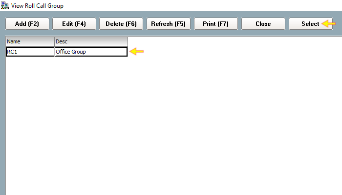

# How to configure Roll Call Group

## List of Steps

#### STEP 1: Proceed to Control Panel Tab and click on ‘System’. Next, click ‘Roll Call Group’.

#### STEP 2: Click ‘Add \(F2\)’ to create a group.

#### STEP 3: Provide a Name and Description to this group. Click ‘Save and Close’ once completed.

#### STEP 4: Return to Control Panel Tab and proceed to ‘Controller’.

#### STEP 5: Select the desired Control Panel that you would like to enable Roll Call feature. Click Edit \(F4\).

#### STEP 6: Proceed to ‘Door Setting’ tab. Scroll to locate Roll Call Reader and click on the door that you would like to enable Roll Call feature. Next, proceed to ‘Roll Call Group’ and click on ‘Undefined’.

#### STEP 7: Select the Roll Call group that had been created. Click ‘Select’.

#### STEP 8 & COMPLETE: Click ‘Accept’ once done and Roll Call Group function will be active.

## Quick Note

Once Roll Call Group is active, you can refer to Roll Call Tab to track the latest updates on Users that is located within an area.

