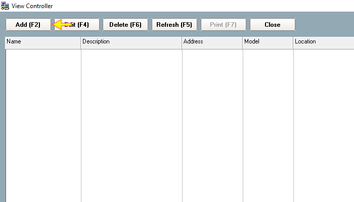
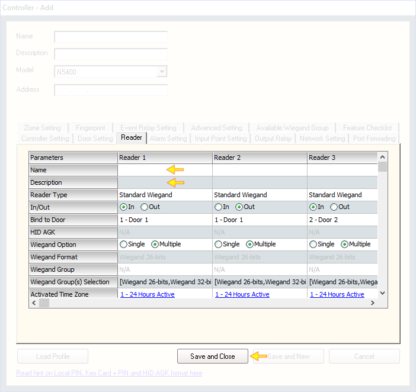

# Add New Control Panel \(without using wizard\)

## List of Steps

#### STEP 1: Proceed to ‘Control Panel Tab’ and click on the icon ‘Controller’ to continue.

#### STEP 2: Click ‘Add \(F2\)’

#### STEP 3: The add Control Panel pop-up will appear.

1. Provide a name and description to the control panel
2. Choose the **'Model'** of this control panel \(see Quick Note 1\)
3. Input the **'Network Address'** of the control panel \(see Quick Note 2\)
4. Proceed to 'Controller Setting' and key in the **'Current Port No'** \(see Quick Note 2\)

#### STEP 4: Proceed to ‘Door Setting’. Provide a name to ‘Doors’ and ‘Description’.

#### STEP 5 & COMPLETE: Proceed to ‘Reader’ tab and a name for 'Reader Name' and 'Description'. To complete the setting, click 'Save and Close'. The Platform1 Server will begin to configure the control panel into its device listing.

## Quick Note

1. This guide will use N5400 Network Control Panel as an illustration. For a more detailed list of Control Panel settings, please refer to Platform1 Server Manual by pressing \(F1\) on your keyboard. 
2. To get the Network address and Port No, you can obtain it from:
   * your System Installer \(SI\)
   * The manual Entrypass Platform1 Server 'Quick Start-Up Guide' if the Control Panel is set up under default settings.

