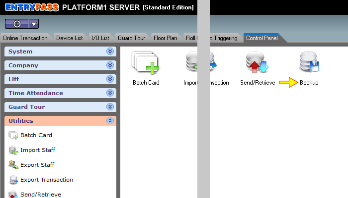
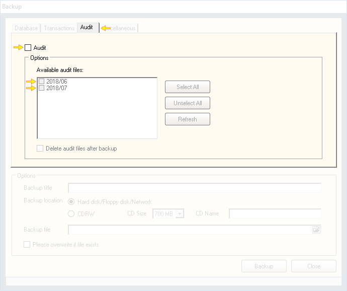
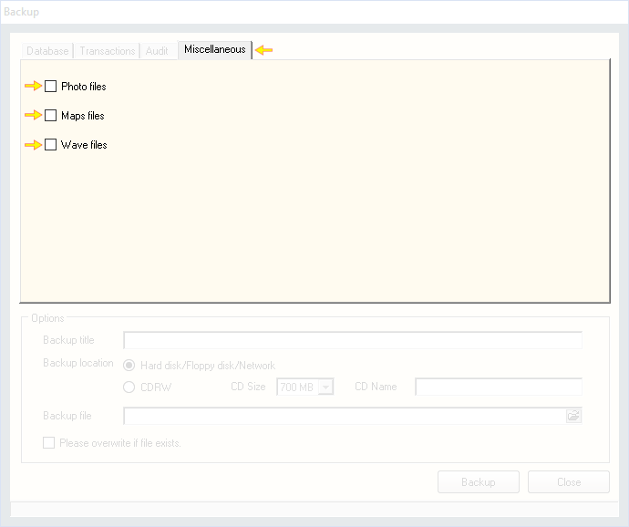
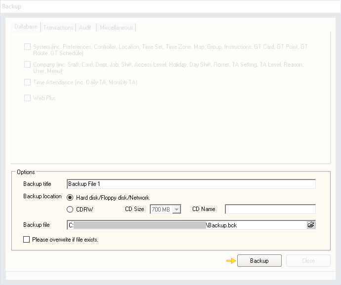

# Backing up data on Platform1 Server

## List of Steps

#### STEP 1: Proceed to ‘Control Panel Tab’ and click on ‘Utilities’ drop down menu.

#### STEP 2: Click ‘Backup’.

#### STEP 3: On the ‘Database’ Tab, tick the type of data to backup \(refer to Quick Note 1\).

#### STEP 4: \(Option\) On the ‘Transactions’ Tab, tick ‘Transaction’ and also the month that you would like to backup \(refer to Quick Note 2\).

#### STEP 5: \(Option\) On the ‘Audit’ Tab, tick ‘Audit’ and also the month that you would like to backup \(refer to Quick Note 3\).

#### STEP 6: \(Option\) On the ‘Miscellaneous’ Tab, tick Photo files, Maps files or Wave files that you would like to backup \(refer to Quick Note 4\).

#### STEP 7: Proceed to the section ‘Options’ and provide a file name in the 'Backup title' row.

#### STEP 8: Proceed to Backup location and choose the medium for backup. If CDRW method is chosen, key in a name in the ‘CD Name’ row.

#### STEP 9: Proceed to Backup file and click on the icon ‘Open file location’.

#### STEP 10: Specify the location where the file will be backed up to and provide a name for the backup file in the ‘File Name’ row. Click ‘Open’ when done.

#### STEP 11 & COMPLETE: Click ‘Backup’ to backup the Platform1 Server Data \(refer to Quick Note 5\). Once backup is complete, a file with an extension of **'.bck'** will be created in the location that you have specified. 

## Quick Note

1. **Web Plus:** This is a special feature and is to be ignored.
2. **Transaction:** This would include all transaction messages that occurred during the period chosen.
3. **Audit:** This would include all audit trail information occurred during the period chosen.
4. **Miscellaneous:** This would include Photo Files related to staff, Maps files related to Floor Plan and also Wave files related to Instructions and Comments.
5. **Please overwrite if file exists:** Please note that this feature should be enabled \(ticked\) to overwrite an existing backup file. If this row is not ticked, the system will still proceed with the back up process BUT will not overwrite the existing file. 

