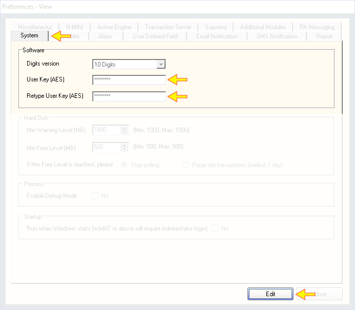
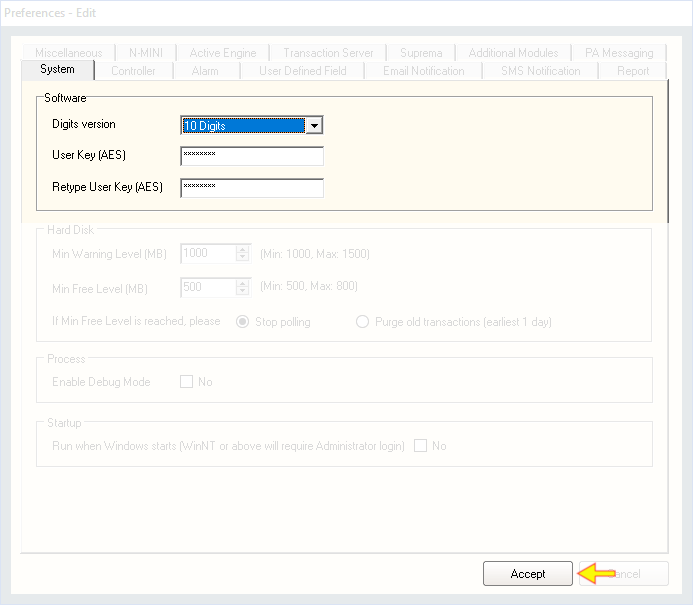

# Change AES User Key

## List of Steps

#### STEP 1: Proceed to ‘Control Panel Tab’ and click on the icon ‘Preferences’ to continue.

#### STEP 2: Under the **'System'** Tab, click **‘Edit’** and fill in the AES User Key.

#### STEP 3: Click ‘Accept’.

## Complete

Once the Accept button is clicked, AES encryption will take effect. 

