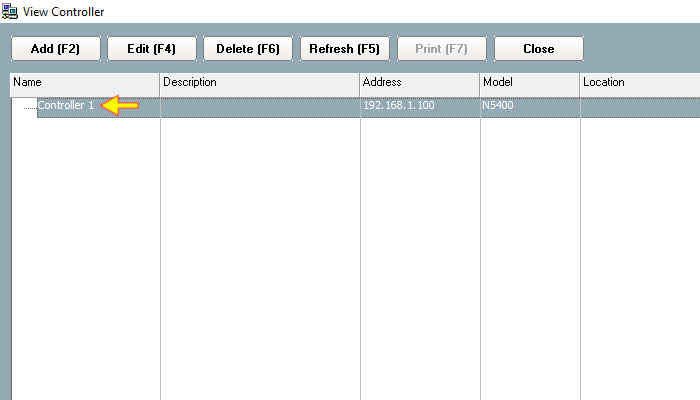
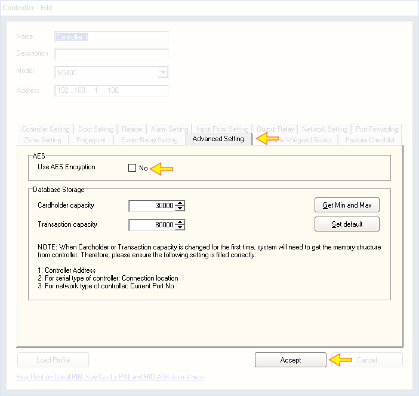

# Enabling AES Encryption

## List of Steps

#### STEP 1: Proceed to ‘Control Panel Tab’ and click on the icon ‘Controller’ to continue.

#### STEP 2: Choose the Control Panel from Controller list. Click ‘Edit \(F4\)’.

#### STEP 3 & COMPLETE: Click ‘Advanced Setting Tab’ and tick ‘Use AES Encryption’. Click ‘Accept’. The Platform1 Server will begin to update the Control Panel to use AES Encryption.

## Alternative method to enable AES encryption

During setting up of Control Panel using **‘Add New Controller Wizard’**, AES encryption can be enabled during this phase. Please refer to manual: 


* Quick Set Up Guide \(Ver 1.0\)
* Section: 1.4 \(Step 4\) 
* Proceed to **‘Advanced Setting’**. 
* Tick **‘Use AES Encryption’** and click **‘Next’** to continue the set-up.


