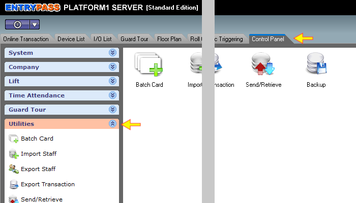
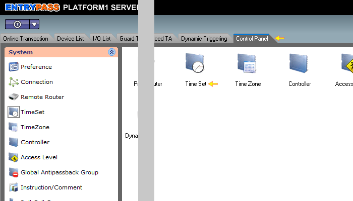
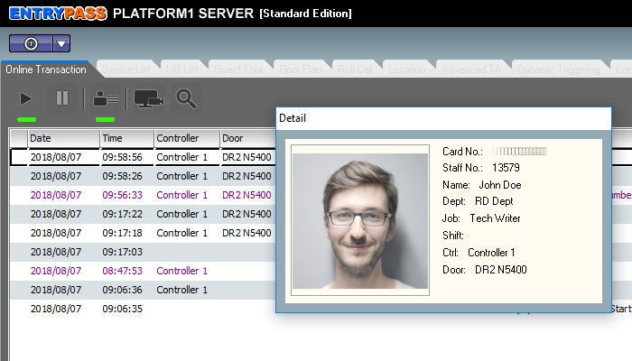
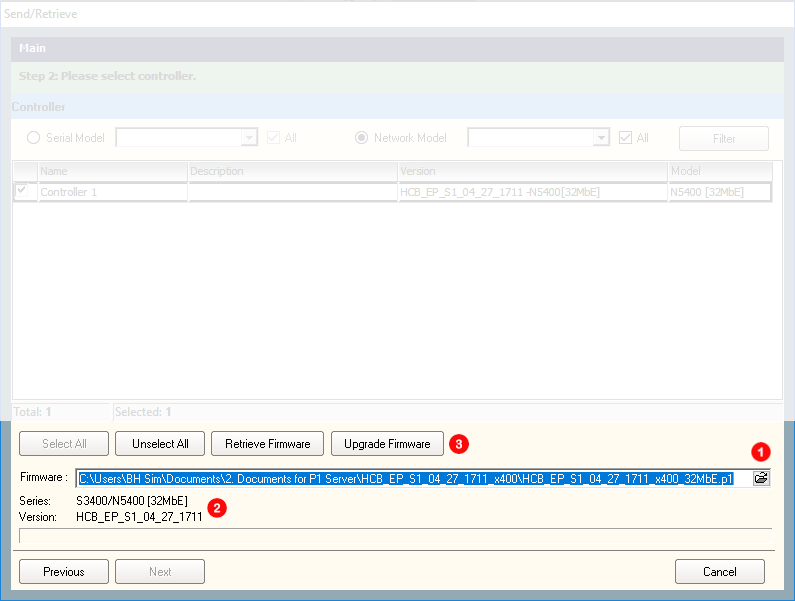

# Firmware Upgrade

## List of Steps

#### STEP 1: Proceed to ‘Control Panel Tab’ and click on ‘Utilities’ drop down menu.

#### STEP 2: Click ‘Send / Retrieve’.

#### STEP 3: On the ‘Send / Retrieve’ screen, tick ‘Firmware Upgrade’. Click 'Next'. 

#### STEP 4: Click either ‘Serial Model’ OR ‘Network Model’. Select ‘Filter’ to list out the Control Panels.

#### STEP 5: Tick on the Control Panel and click ‘Retrieve Firmware’ to check the firmware version and model that the Control Panel is currently under.

#### STEP 6: 

1. Locate the firmware file by opening the file 'location icon'. 
2. Once the file had been selected, you will be able to see the Series and Version of the file.
3. Once you have ensured that the file version is correct, you can proceed to click 'Upgrade Firmware'.

