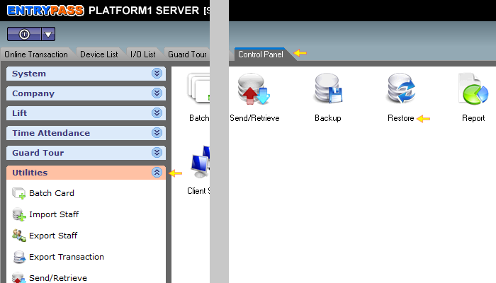

# How to restore data on Platform1 Server

## List of Steps

#### STEP 1: Proceed to ‘Control Panel Tab’ and click on ‘Utilities’ drop down menu. Next, click ‘Restore’.

#### STEP 2: On the ‘Path’ section, look for the backup file by clicking on the ‘Open File Folder’ icon.

#### STEP 3: \(Option\) Click ‘Read Content’ to identify the various types of files that will be restored back into the server.

#### STEP 4: On the ‘Options’ section, choose to restore the data to Application Path or Other Path. Click ‘Restore’ when ready.

## Complete

Once the restoration process is complete, you shall be able to see various information that you have backed up had been restored to the server. 

## Quick Note

1. Application path would refer to the original Platform1 Server installed location while Other path would mean location other than the original installed folders.

