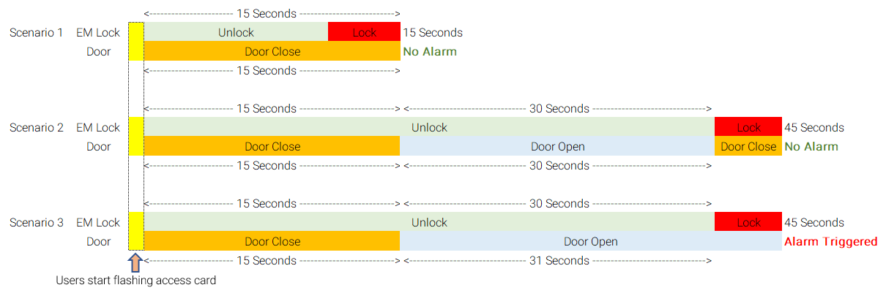

# Doors

## Door \(Image\)

## List of Parameters

### 1. Name 

This parameter highlights the name of the Doors that had been assigned earlier during Adding New Control Panel \(refer to 3.1.1.2\). The name of the doors assigned should be unique and identifiable as demonstrated in the later stages \(Reader Settings\) it will greatly aid you in identifying the correct doors for various uses.

### 2. Description 

This parameter will highlight the description that you have set up during Adding New Control Panel \(refer to 3.1.1.2\).

### 3. Lock Release Time 

This parameter will dictate the time that Electromagnetic locks \(EM Lock\) will stay unlocked under Lock Release Time option. The release period will be measured in ‘seconds’. To understand and activate this feature, proceed to xxv. Lock Energize Option.

### 4. Open Time \(sec\)

This parameter will dictate the time that Electromagnetic locks \(EM Lock\) will stay unlocked under Open Time option. The release period will be measured in ‘seconds’. To understand and activate this feature, proceed to xxv. Lock Energize Option.

### 5. Entry and Exit Zone ID 

This parameter will dictate the entry and exit zone for readers. Entry zones can bear any number however it is very important to know that both entry and exit zones should not have similar ID’s \(Platform1 Server does not strictly prohibit similar ID values for entry and exit zones\) as doing so, will render the system unable to track entry and exit of individuals for Roll Call and Antipassback Functions.

### 6. Card + Pin Time Zone 

This parameter will dictate whether Card + Pin is active or inactive. By activating this feature, a user would be required to furnish additional credential when they flash their access cards which is the ‘pin number’ which had been assigned to that individual when he / she was registered as a staff. By default, the Card + Pin Time Zone will be set at ‘0 – inactive’ and to activate this feature, just select a Time Zone that this feature is to operate upon.

### 7. Card + Pin Lockout Count 

This parameter will dictate the number of times a user will be allowed to incorrectly enter their assigned pin number after flashing their access card at the terminal.

### 8. Lock Release Time Zone 

This parameter will dictate the time period an electromagnetic lock will stay ‘unlocked’. By default, this feature is inactive however if a Time Zone is being assigned to this feature e.g. Monday to Sunday at 18:00PM – 20:00PM, then the electromagnetic lock will stay ‘UNLOCKED’ throughout 18:00PM – 20:00PM and the door can be freely opened and closed without the need to flash access cards. After 20:00, the electromagnetic lock will resume back to its original state of locking the door.

### 9. Exit Button Enabled Time Zone 

This parameter will dictate the time period in which the exit button feature will be active. By default, this feature is active 24hrs a day so as to enable user to use the exit button when exiting a door. When a Time Zone other than the default 24hrs is chosen e.g. 08:00AM – 18:00PM, the exit button will only stay active within 08:00AM – 18:00PM while anytime before or after this Time Zone, the exit button is inactive.

### 10. Antipassback Time Zone 

This parameter will dictate the time period in which Antipassback \(please refer to the feature Antipassback\) will be active. By default this feature will be inactive and when a Time Zone had been assigned to this feature, Antipassback feature will stay active throughout the time period.

### 11. Antipassback Lockout 

This parameter will dictate the time period in which the Antipassback

### 12. Buddy Mode Time Zone 

This parameter will dictate the time period in which the Buddy Mode will be active. For more information on Buddy Mode feature please refer to ‘5.8 How to Configure Buddy Mode’. By default, this feature is inactive and when a Time Zone is assigned to this feature, Buddy Mode feature will stay active throughout the time period.

### 13. Pin 1 to Pin 3 

This is where you will be able to set the Pin Number for local doors. By setting a Pin Number for the Doors, the User would have to key in this Pin Number \(up to three different pins\) whenever they flash their access control cards to the reader. This feature is a universal feature where all users will be required to key in the pin, irrespective of whether ‘Pin + Card’ feature is enabled or not.

### 14. Pin 1 to Pin 3 Time Zone 

This parameter is where you can set the time period in which the Pin numbers will be active. By default, this feature is inactive and when a Time Zone is assigned to this feature, Pin 1 to Pin 3 feature will stay active throughout the time period.

### 15. Pin Lock Out Count 

This parameter will dictate the number of times a user will be allowed to enter ‘wrong’ Pin Numbers. Once a user incorrectly entered wrong pin number exceeding the allowable count specified within this parameter, a lockout will occur.

### 16. Time Attendance reader 

This parameter will enable the feature for Time Attendance. By enabling this feature, the door will record data required for Time Attendance Reporting. By default, this feature is inactive and by ticking the checkbox, this will activate the feature and will be active at all times.

### 17. Roll Call Reader 

This parameter will enable the Roll Call feature. For more information on Roll Call feature please refer to ‘5.9 How to Configure Roll Call Group’. By default, this feature is inactive and by ticking the checkbox, this will activate the feature and will be active at all times.

### 18. Roll Call Group 

This parameter will enable you to set the Roll Call Group that had been created within the Roll Call Group List. To choose the group, click the ‘undefined’ \(this is the default setting\) and choose the group from the available list. If there are no groups available, you can create the group by pressing the button ‘Add \(F2\)’.

### 19. Check Card Expiry Date 

This parameter will enable you to check each users’ card expiry date. Card Expiry settings can be found in ‘Staff’ settings, ‘6.1 How to enrol Users’. When the card is expired, a user will not be allowed to enter the designated door either a new card had been issued to the user OR the expiry date of the card is extended.

### 20. Software Fire Release 

This parameter will enable the integration of Fire Release feature where once this feature is enabled, it will work in conjunction with fire sensors to turn off the security of the doors when fire sensors were triggered \(refer to ‘How to Configure Fire Release’.\)

### 21. Fire Release Group 

This parameter will enable you to choose the group of doors to be released \(security turned off\) in the event that fire alarms were triggered. To create Fire Release Group, refer to the section ‘5.6.1 How to configure Fire Release Group’.

### 22. Security Mode 

This parameter will enable you to toggle the security mode in either ‘Low’ or ‘High’ settings. This toggle will affect the ‘EXIT Reader’ only and below would be a list of functions that will be affected by this setting:

| Low Security Mode | High Security Mode |
| --- | --- |
|  |  |

### 23. Keyed Card + Pin Time Zone 

This parameter will enable the feature Keyed Card + Pin Time Zone. By default this feature will be inactive and when a Time Zone had been assigned to this feature, Keyed Card + Pin Time Zone feature will stay active throughout the time period. Keyed Card is a feature where users do not possess the ‘physical card’ however, they have the ‘Card Number’ that is allocated to them. When using a terminal, instead of flashing the physical access card, users would have to key in the ‘card number’ in conjunction with the ‘pin number’ of the terminal.

### 24. Enable Interlock 

This parameter will enable the Interlock feature. To further understand the ‘Interlock Feature’ refer to ‘5.5 How to configure ‘Interlock Feature’.

### 25. Lock Energize Option 

This parameter will allow you to choose to de-energize \(Unlock\) the Electromagnetic Lock \(EM Lock\) by: 

* **Release Time:** The EM Lock is unlocked and the time period of unlock is calculated from THE TIME EM LOCK IS DE-ENERGIZED \(UNLOCKED\). 
* **Open Time:** The EM Lock is unlocked and the time period of unlock is calculated when THE DOOR IS OPENED \(UNLOCKED\).

To further illustrate between the differences in both modes, refer to the below where both options is set with different time period: 

* Release Time Setting: 15 Seconds 
* Open Time Setting: 30 Seconds 

#### **Infographic Illustration**

_Lock Energize option = Open Time_

_Scenario 1_

1. When a user flashes his access card at the reader
2. The EM Lock unlocks \(unlock period of 15 seconds IS CALCULATED FROM NOW\)
3. Door is left UNOPENED
4. EM Lock re-energize \(lock\) when door is left unopened. 

_Scenario 2_

1. When a user flashes his access card at the reader
2. The EM Lock unlocks \(unlock period of 15 seconds IS CALCULATED FROM NOW\)
3. The door is OPENED 15 seconds later. 
4. EM Lock time will follow 'Open Time' \(30 Seconds\). The status of EM Lock at this time is still UNLOCKED.
5. Door close 30 seconds after it was opened. EM Lock will re-energize. No alarm will be triggered.

Scenario 3

1. When a user flashes his access card at the reader
2. The EM Lock unlocks \(unlock period of 15 seconds IS CALCULATED FROM NOW\)
3. The door is OPENED 15 seconds later. 
4. EM Lock time will follow 'Open Time' \(30 Seconds\). The status of EM Lock at this time is still UNLOCKED.
5. Door STAYED OPEN after 30 seconds. EM Lock will re-energize. Alarm will be triggered with the message 'Door is left open'. 

### 26. Door Sensor Delay 

This parameter will enable you to set a ‘delay’ in registering of doors’ open/close status within EntryPass Platform1 Server Standard Edition. The time period is measured in ‘units’ i.e. 1 unit \(0.1 Seconds\) while maximum units is at 255 \(approx.. 14 seconds\). When an event happen e.g. a door being forced open, that event reporting will be delayed hence, the triggering of alarm will also be delayed by the number of units that had been set.

### 27. Authorisation Lock Release

