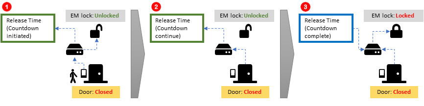
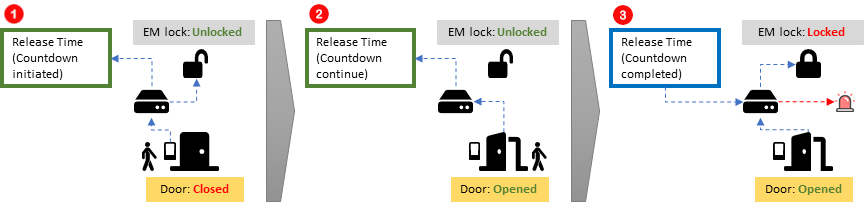
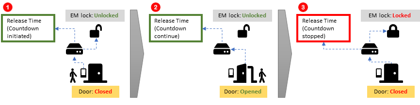
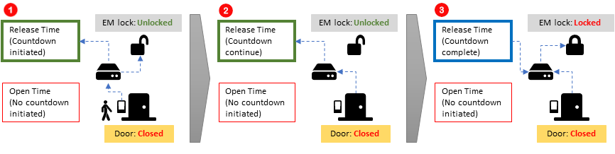
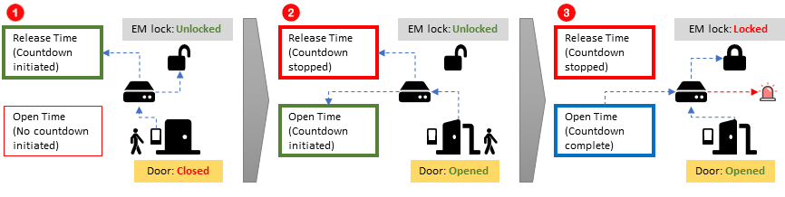
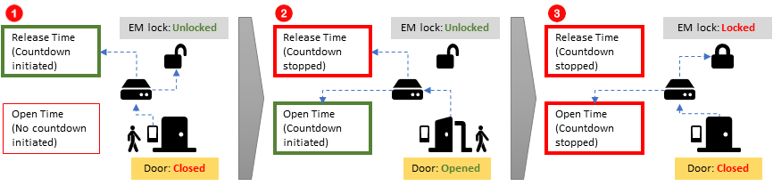

# Doors

## Door Setting \(Image\)

## 1. Name 

This parameter highlights the name of the Doors that had been assigned earlier during Adding New Control Panel \(refer to below 'Add New Control Panel'\). The name of the doors assigned should be unique and identifiable which will be demonstrated in Reader Settings \(refer to below 'Readers'\) it will greatly aid you in identifying the correct doors for various uses.





## 2. Description 

This parameter will highlight the description that you have set up during Adding New Control Panel \(refer to below 'Add New Control Panel'\).



## 3. Lock Release Time 

This parameter will dictate the time that Electromagnetic locks \(EM Lock\) will stay unlocked under Lock Release Time option. The release period will be measured in ‘seconds’. To understand and activate this feature, proceed to **'25. Lock Energize Option'**. 

## 4. Open Time \(sec\)

This parameter will dictate the time that Electromagnetic locks \(EM Lock\) will stay unlocked under Open Time option. The release period will be measured in ‘seconds’. To understand and activate this feature, proceed to **'25. Lock Energize Option'**.

## 5. Entry and Exit Zone ID 

This parameter will dictate the entry and exit zone for readers. Entry zones can bear any number however it is very important to know that both entry and exit zones should not have similar ID’s \(Platform1 Server does not strictly prohibit similar ID values for entry and exit zones\) as doing so, will render the system unable to track entry and exit of individuals for **Roll Call and Antipassback Functions** \(refer to Roll Call and Antipassback feature below\).



## 6. Card + Pin Time Zone 

This parameter will dictate whether Card + Pin is active or inactive. By activating this feature, a user would be required to key in their personal Pin Number when they flash their access cards. **This ‘pin number’ is assigned to that individual when he / she during staff registration process**. By default, the Card + Pin Time Zone will be set at ‘0 – inactive’ and to activate this feature, just select a Time Zone that this feature is to operate upon.

## 7. Card + Pin Lockout Count 

This parameter will dictate the number of times a user will be allowed to incorrectly enter their assigned pin number after flashing their access card at the terminal.

## 8. Lock Release Time Zone 

This parameter will dictate the time period an electromagnetic lock will stay ‘unlocked’ \(security turned off\). By default, this feature is inactive however if a Time Zone is being assigned to this feature e.g. Monday to Sunday at 18:00PM – 20:00PM, then the electromagnetic lock will stay ‘UNLOCKED’ throughout Sunday 18:00PM – 20:00PM and **the door can be freely opened and closed without the need to flash access cards**. After 20:00, the electromagnetic lock will resume to its original state of locking the door and staffs would need to flash their access cards to open the door.

## 9. Exit Button Enabled Time Zone 

This parameter will dictate the time period in which the exit button feature will be active. By default, this feature is active 24hrs a day so as to enable user to use the exit button when exiting a door. When a Time Zone other than the default 24hrs is chosen e.g. 08:00AM – 18:00PM, the exit button will only stay active within 08:00AM – 18:00PM while anytime before or after this Time Zone, the exit button is inactive.

## 10. Antipassback Time Zone 

This parameter will dictate the time period in which Antipassback \(please refer to the feature Antipassback under Access Control Features\) will be active. By default this feature will be inactive and when a Time Zone had been assigned to this feature, Antipassback feature will stay active throughout the time period.



## 11. Antipassback Lockout 

This parameter will enable a 'Lockout' in the event that the Antipassback feature is triggered. The access card that the staff is holding will no longer be allowed to enter the door until the lockout is reversed by the System Administrator. If the card continue to be flashed while it is still under Antipassback lockout, it will result in a 'Card Lockout' in which, the card no longer can be used on **ANY** doors until the lockout is cleared. To clear the lockout, please visit the section 'Send / Retrieve' \(Specific\) in Platform1 Server manual. 

## 12. Buddy Mode Time Zone 

This parameter will dictate the time period in which the Buddy Mode will be active. For more information on Buddy Mode feature please refer to 'Buddy Mode' under Access Control Feature page below. By default, this feature is inactive and when a Time Zone is assigned to this feature, Buddy Mode feature will stay active throughout the specified time period.



## 13. Pin 1 to Pin 3 

This is where you will be able to set the Pin Number for local doors. **This setting will enable any staff to access a door by keying in the pin number at readers without the need to flash their access cards.** 

## 14. Pin 1 to Pin 3 Time Zone 

This parameter will set the time period in which the Pin numbers will be active \(for no.13\). By default, this feature is inactive and when a Time Zone is assigned to this feature, Pin 1 to Pin 3 feature will stay active throughout the time period.

## 15. Pin Lock Out Count 

This parameter will dictate the number of times a user will be allowed to enter ‘wrong’ Pin Numbers at the reader. Once a staff incorrectly entered the wrong pin number exceeding the allowable count specified in this parameter, a 'card lockout' will occur.

## 16. Time Attendance reader 

This parameter will enable the feature for Time Attendance. By enabling this feature, the door will record data required for Time Attendance Reporting. By default, this feature is inactive and by ticking the checkbox, this will activate the feature and it will be active at all times.

## 17. Roll Call Reader 

This parameter will enable the Roll Call feature. For more information on Roll Call feature please refer to Roll Call under Access Control Feature page below. By default, this feature is inactive and by ticking the checkbox, this will activate the feature and will be active at all times.



## 18. Roll Call Group 

This parameter will enable you to set the Roll Call Group that had been created within the Roll Call Group List. To choose the group, click the ‘undefined’ \(this is the default setting\) and choose the group from the available list. If there are no groups available, you can create the group by pressing the button ‘Add \(F2\)’.

## 19. Check Card Expiry Date 

This parameter will enable you to check each users’ card expiry date. Card Expiry settings can be found in ‘Card Data’ tab **\(STEP 5: under item labelled as 'End Date'\)** in 'How to Set Up Staff' page below. When the card is expired, a user will not be allowed to enter the designated door either a new card had been issued to the user OR the expiry date of the card is extended.



## 20. Software Fire Release 

This parameter will enable the integration of Fire Release feature where once this feature is enabled, it will work in conjunction with fire sensors to turn off the security of the doors when fire sensors were triggered \(refer to ‘Fire Release’ under Access Control features page below\).



## 21. Fire Release Group 

This parameter will enable you to choose the group of doors to be released \(security turned off\) in the event that fire alarms were triggered. To create Fire Release Group, refer to the page ‘How to configure Fire Release Group’ below.



## 22. Security Mode 

This parameter will enable you to toggle the security mode in either ‘Low’ or ‘High’ settings. This toggle will affect the ‘EXIT Reader’ only and below would be a list of functions that will be affected by this setting:

| Feature | Low Security Mode | High Security Mode |
| :--- | :--- | :--- |
| Antipassback | Users **will be allowed** to pass through the door even when there is a violation of Antipassback feature. | Users **will not be allowed** to pass through the door when there is a violation of Antipass back feature. |
| Nested Car Park | Users **will be allowed** to exit the car park lot even when there is a violation of exiting procedure. | Users **will not be allowed** to exit the car park lot when there is a violation of exiting procedure. |

## 23. Keyed Card + Pin Time Zone 

This parameter will enable the feature Keyed Card + Pin Time Zone. By default this feature will be inactive and when a Time Zone had been assigned to this feature, Keyed Card + Pin Time Zone feature will stay active throughout the time period. Keyed Card + Pin Time Zone is a feature where users do not possess the ‘physical card’ however, they have the ‘Card Number’ that is assigned to them. When using a terminal, instead of flashing the physical access card, users would have to key in the ‘card number’ in conjunction with the ‘pin number’ of the terminal. 

## 24. Enable Interlock 

This parameter will enable the Interlock feature. To further understand the ‘Interlock' feature refer to page Access Control Features below.



## 25. Lock Energize Option 

This parameter will allow you to choose to de-energize \(Unlock\) the Electromagnetic Lock \(EM Lock\) by: 

* **Release Time:** Time period of unlock **starts from THE TIME EM LOCK IS DE-ENERGIZED \(UNLOCKED\).** 
* **Open Time:** Time period of unlock **starts when THE DOOR IS OPENED \(UNLOCKED\).**

### **Infographic Illustration \(Lock Energize Option = Release Time\)**

1. A Staff flashes his access card at the reader, the Control Panel unlocks the EM Lock and start the countdown for Release Time. 
2. However, the Staff did not pass through the door and it is left UNOPENED. At this moment, the door sensor detected that the door still remain closed therefore Release Time countdown will continue.
3. When the Release Time countdown is completed the control panel will re-energise \(Re-lock\) the 

   EM Lock. The door sensor detected that the door remain closed therefore, no alarms will be triggered by the Control Panel.

1. A Staff flashes his access card at the reader, the Control Panel unlocks the EM Lock and start the countdown for Release Time. 
2. The Staff open and passes through the door. The door sensor detected the door is opened and Release Time countdown continues. The EM Lock remain unlocked at this time.
3. At this point in time, the door was left opened by the staff. The Release Time countdown is completed and the Control Panel re-energises the EM Lock \(Re-lock\). At this point in time, the door sensor detected the door was left opened and the control panel will trigger the alarm.

1. A Staff flashes his access card at the reader, the Control Panel unlocks the EM Lock and start the countdown for Release Time. 
2. The Staff open and passes through the door. The door sensor detected the door is opened and Release Time countdown continues. The EM Lock remain unlocked at this time.
3. The staff closes the door behind him and the door sensor had detected that the door is closed. The Control Panel re-energises \(re-lock\) the EM Lock and stops the Release Time countdown.

\_\_

### **Infographic Illustration \(Lock Energise Option = Open Time\)**

1. A Staff flashes his access card at the reader, the Control Panel unlocks the EM Lock and start the countdown for Release Time. 
2. However, the Staff did not pass through the door and it is left UNOPENED. At this moment, the door sensor detected that the door still remain closed therefore Release Time countdown will continue.
3. When the Release Time countdown is completed the control panel will re-energise \(Re-lock\) the 

   EM Lock. The door sensor detected that the door remain closed therefore, no alarms will be triggered by the Control Panel.

1. A Staff flashes his access card at the reader, the Control Panel unlocks the EM Lock and start the countdown for Release Time. 
2. The Staff open and passes through the door. The door sensor detected the door is opened, stops the Release Time countdown and starts the Open Time Countdown. The EM Lock remain unlocked at this time.
3. At this point in time, the door was left opened by the staff. The Open Time countdown is completed and the Control Panel re-energises the EM Lock \(Re-lock\). At this point in time, the door sensor detected the door was left opened and the control panel will trigger the alarm.

1. A Staff flashes his access card at the reader, the Control Panel unlocks the EM Lock and start the countdown for Release Time. 
2. The Staff open and passes through the door. The door sensor detected the door is opened, stops the Release Time countdown and starts the Open Time Countdown. The EM Lock remain unlocked at this time.
3. The staff closes the door behind him and the door sensor had detected that the door is closed. The Control Panel re-energises \(re-lock\) the EM Lock and stops the Open Time countdown.


Important note on Open Time: 

Only when a door is opened, Open Time countdown will begin while stopping Release Time countdown.


## 26. Door Sensor Delay 

This parameter will enable you to set a ‘delay’ in registering of doors’ open/close status within EntryPass Platform1 Server Standard Edition. The time period is measured in ‘units’ i.e. 1 unit \(0.1 Seconds\) while maximum units is at 255 \(approx.. 14 seconds\). When an event happen e.g. a door being forced open, that event reporting will be delayed hence, the triggering of alarm will also be delayed by the number of units \(time\) that had been set.

## 27. Authorisation Lock Release

Authorisation Lock Release is a feature related to **8. Lock Release Time Zone.** 

When this feature is DISABLED, the door will automatically stay unlocked when 'Lock Release Time Zone' is active.

When this feature is ENABLED, the door will only STAY UNLOCK when a first valid card flash, Local Pin or Keyed Card + Pin takes place during the active time zone. Therefore authorisation lock release will not unlock/release the door even when Lock Release Time Zone is active.

#### Consider the following scenario below:


Lock Release Time Zone: Mon - Fri \(6pm - 8pm\)

When Authorisation Lock Release is disabled: The **door will automatically** unlock itself at 6pm and will continue to stay unlocked until 8pm. Thereafter, the door will be locked again.

When Authorisation Lock Release is enabled: The **door will not automatically** unlock at 6pm. **The door will stay locked until a valid card flash, Local Pin or Keyed Card + Pin had been performed at the terminal.** When one of the conditions had been performed at the terminal, only then the door will unlock and stay unlocked onwards until 8pm. Thereafter. the door will be locked again.


