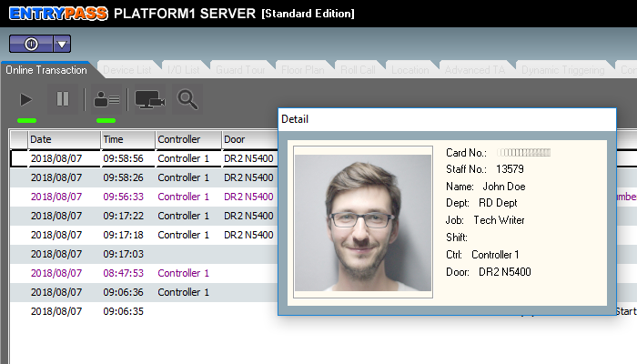

# Doors

### Door \(Image\)

### 1. Name 

This parameter highlights the name of the Doors that had been assigned earlier during Adding New Control Panel \(refer to 3.1.1.2\). The name of the doors assigned should be unique and identifiable as demonstrated in the later stages \(Reader Settings\) it will greatly aid you in identifying the correct doors for various uses.

### 2. Description 

This parameter will highlight the description that you have set up during Adding New Control Panel \(refer to 3.1.1.2\).

### 3. Lock Release Time 

This parameter will dictate the time that Electromagnetic locks \(EM Lock\) will stay unlocked under Lock Release Time option. The release period will be measured in ‘seconds’. To understand and activate this feature, proceed to xxv. Lock Energize Option.

### 4. Open Time \(sec\)

This parameter will dictate the time that Electromagnetic locks \(EM Lock\) will stay unlocked under Open Time option. The release period will be measured in ‘seconds’. To understand and activate this feature, proceed to xxv. Lock Energize Option.

### 5. Entry and Exit Zone ID 

This parameter will dictate the entry and exit zone for readers. Entry zones can bear any number however it is very important to know that both entry and exit zones should not have similar ID’s \(Platform1 Server does not strictly prohibit similar ID values for entry and exit zones\) as doing so, will render the system unable to track entry and exit of individuals for Roll Call and Antipassback Functions.

### 6. Card + Pin Time Zone 

This parameter will dictate whether Card + Pin is active or inactive. By activating this feature, a user would be required to furnish additional credential when they flash their access cards which is the ‘pin number’ which had been assigned to that individual when he / she was registered as a staff. By default, the Card + Pin Time Zone will be set at ‘0 – inactive’ and to activate this feature, just select a Time Zone that this feature is to operate upon.

### 7. Card + Pin Lockout Count 

This parameter will dictate the number of times a user will be allowed to incorrectly enter their assigned pin number after flashing their access card at the terminal.

### 8. Lock Release Time Zone 

This parameter will dictate the time period an electromagnetic lock will stay ‘unlocked’. By default, this feature is inactive however if a Time Zone is being assigned to this feature e.g. Monday to Sunday at 18:00PM – 20:00PM, then the electromagnetic lock will stay ‘UNLOCKED’ throughout 18:00PM – 20:00PM and the door can be freely opened and closed without the need to flash access cards. After 20:00, the electromagnetic lock will resume back to its original state of locking the door.

### 9. Exit Button Enabled Time Zone 

This parameter will dictate the time period in which the exit button feature will be active. By default, this feature is active 24hrs a day so as to enable user to use the exit button when exiting a door. When a Time Zone other than the default 24hrs is chosen e.g. 08:00AM – 18:00PM, the exit button will only stay active within 08:00AM – 18:00PM while anytime before or after this Time Zone, the exit button is inactive.

### 10. Antipassback Time Zone 

This parameter will dictate the time period in which Antipassback \(please refer to the feature Antipassback\) will be active. By default this feature will be inactive and when a Time Zone had been assigned to this feature, Antipassback feature will stay active throughout the time period.

### 11. Antipassback Lockout 

This parameter will dictate the time period in which the Antipassback

### 12. Buddy Mode Time Zone 

This parameter will dictate the time period in which the Buddy Mode will be active. For more information on Buddy Mode feature please refer to ‘5.8 How to Configure Buddy Mode’. By default, this feature is inactive and when a Time Zone is assigned to this feature, Buddy Mode feature will stay active throughout the time period.

### 13. Pin 1 to Pin 3 

This is where you will be able to set the Pin Number for local doors. By setting a Pin Number for the Doors, the User would have to key in this Pin Number \(up to three different pins\) whenever they flash their access control cards to the reader. This feature is a universal feature where all users will be required to key in the pin, irrespective of whether ‘Pin + Card’ feature is enabled or not.

