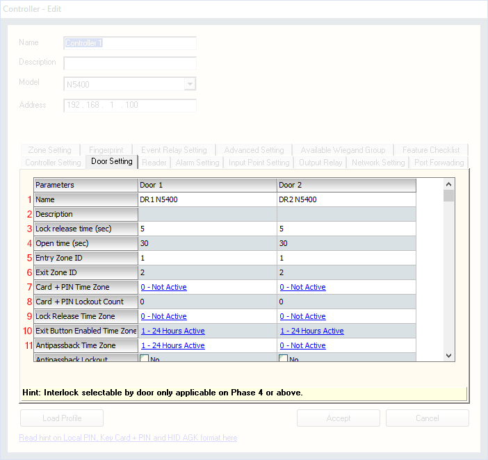

# How to install Firebird Database

#### STEP 1: Insert CD Media into a CD ROM and Platform1 Server Standard / Professional installation  choices will appear.

### 

#### STEP 2: Click ‘Install Firebird Database Engine’.

### STEP 3: 

