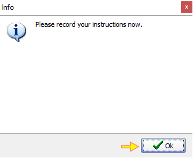
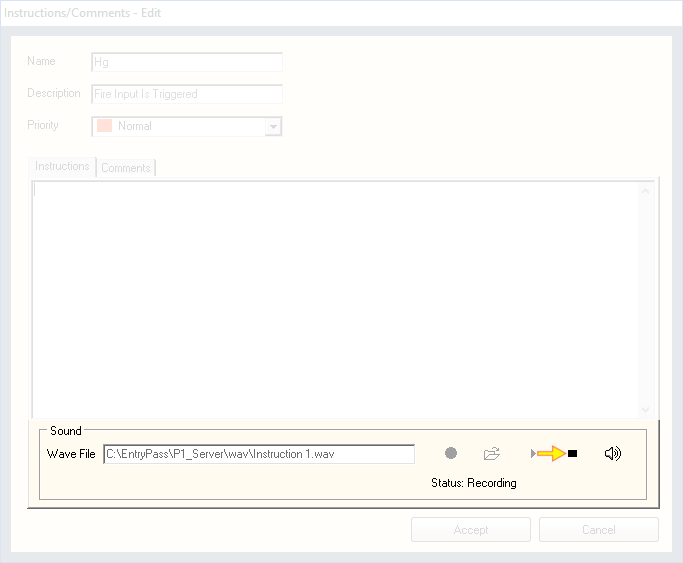

# How to configure instructions and comments for alarms

## List of Steps

#### STEP 1: Proceed to ‘Control Panel Tab’ and click on ‘System’ Menu. Next, click ‘Instructions/Comment’.

#### STEP 2: The 'View Instruction' screen will be displayed. All alarm notification is listed in a scroll down list and proceed select the one that you would like to add comments and instructions appearing on Alarm List Pop Up when an event had been triggered. Once the relevant alarm had been chosen, click ‘Edit \(F4\)’. 

#### STEP 3: The 'Instructions/Comments - Edit' card will appear. Within this section, you can further customize the various instructions and comments contained within each alarm. Refer to the Tab below for further instructions.



This is the alarm code and this code is **NOT EDITABLE**.



This is the description of the alarm and the description is **NOT EDITABLE**.



#### Here, you can set the alarm according to your required priority from 'Lowest' to 'Highest'. By default, all settings are at 'Normal'. 

#### Depending on the priority setting for the alarm, when an event had been triggered, it will showcase itself in the 'Alarm List' according to it's level as shown below.




#### Under this section, you can type the necessary instructions into the instruction box which is intended for Security Personnel view when an alarm event had been triggered. 




#### Under Comments, you can prepare a set of ‘standard’ replies that can used by the security personnel to input replies in the event an alarm is triggered.




#### STEP I: The ‘Sound’ section will allow you to record 'Instructions' \(like no.4\) in voice format. You can either upload wave files \(pre-recorded messages\) OR record them directly from the PC \(the microphone must be enabled\). To start recording, click the red ‘Record’ button.

#### STEP II: Provide a file name for the voice file and click ‘Save’ when done.

#### STEP III: Click ‘Ok’ and start recording your voice. 

#### STEP IV: Once complete recording, click the 'Stop' button.

#### STEP V: To listen back to the recording, click the 'Play' button. 




#### STEP 4 & COMPLETE: When all is completed, click ‘Accept’ when done.

