# Company Report

## Company Report \(Image\)

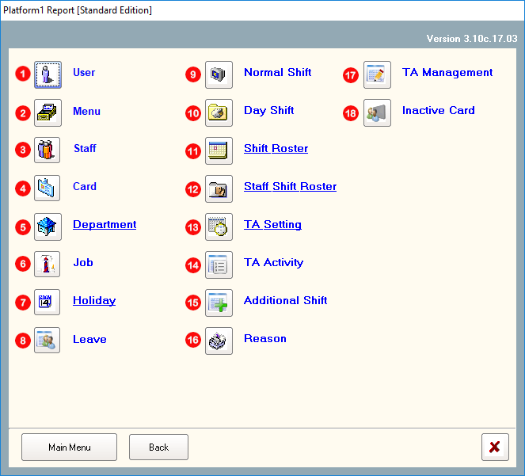

## 1. User

This report will list out all the system users with the login, staff name as well as the 'accessibility' level within the system.

#### To generate the report:

1. You can choose all OR individual users listed within the list box. 
2. Next, click 'Generate'.

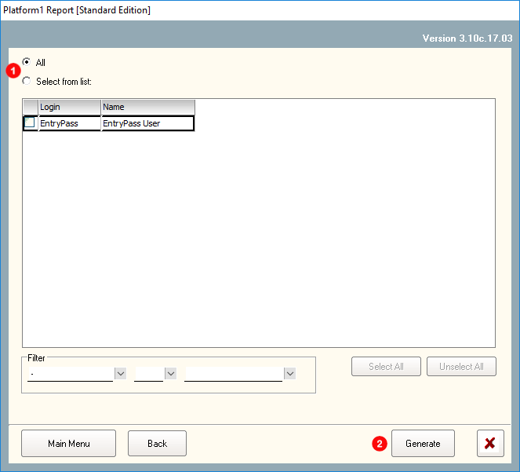



## 2. Menu

This report will list out all System Access settings for system users which had been created in the system. 

#### To generate the report:

1. You can choose all OR individual System Access settings listed within the list box. 
2. Next, click 'Generate'.

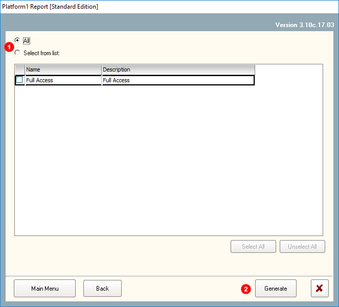



## 3. Staff

This report will list all staff details including user defined fields and the assigned access card details.

#### To generate the report:

1. You can choose all OR individual Staffs listed within the list box.
2. Next, click 'Generate' \(proceed to OPTION 1 & 2 for more options on the report\).



You can choose to either include Access Card details into the report AND to sort the report by Staff No., Department, Name or Job




You can choose to filter the report by the Employment Status \(The employment status of the staff within an organisation\) OR other filters \(Department, Job, Shift or User Defined Fields\).

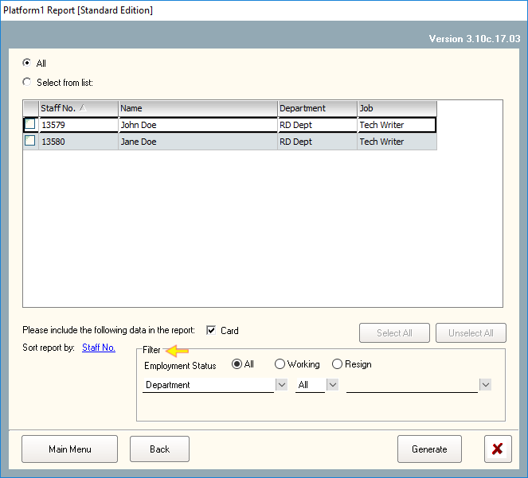





## 4. Card

This report will highlight ALL CARDS registered within the system. It will include details like:

1. Type of card
2. Access Level
3. Antipassback
4. Card Name
5. Access Group
6. Card Start & End Date
7. Buddy Mode
8. NCP ID \(Nested Car Park\)
9. Buddy no.
10. Activation Status

#### To generate the report

1. You can choose all OR individual cards listed within the list box
2. You can filter the report based upon Access Level, Start and End date of the card, Activate Status, Card Type and Access Group. If you do not wish to filter, proceed to 3.
3. Next, click 'Generate'.

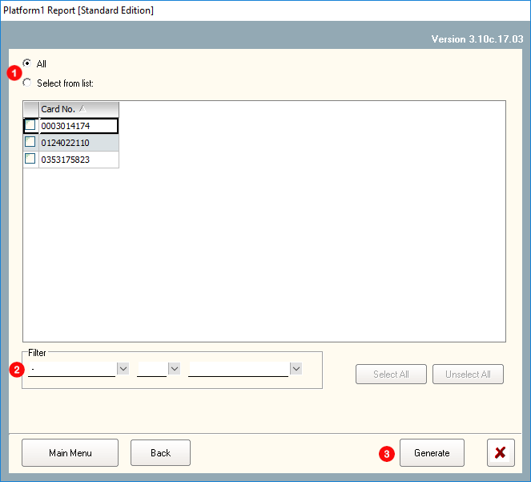



## 5. Department

This report will generate a list of all departments within an organisation.

#### To generate the report:

1. You can choose all OR individual Departments listed within the list box
2. Next, click 'Generate'.

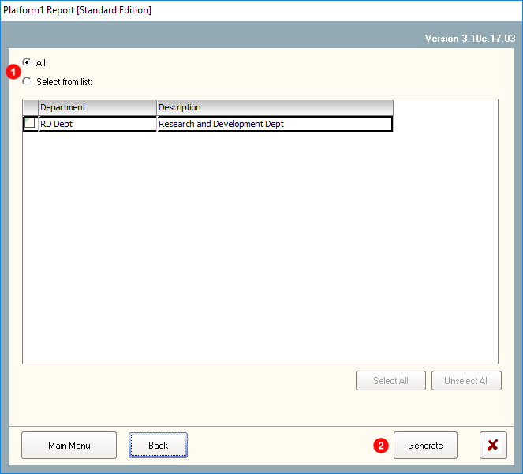



## 6. Job

This report will highlight all 'Job' \(Job Titles\) listed in your organisation.

#### To generate the report:

1. You can choose all OR individual Jobs listed within the list box
2. Next, click 'Generate'.

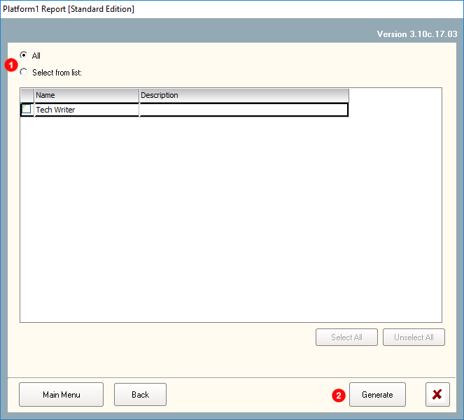



## 7. Holiday

This report will list out all holidays which had been input into the system.

#### To generate the report:

1. You can choose all OR individual Holidays listed within the list box
2. Next, click 'Generate'.

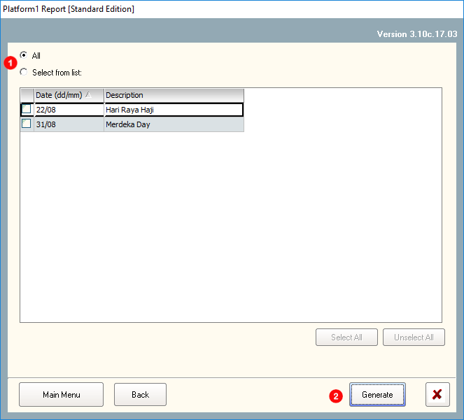



## 8. Leave

This report will list all leaves that had been taken by staff.

#### To generate the report:

* **If choose 'All' option:** 
  1. Proceed to click 'Generate'.

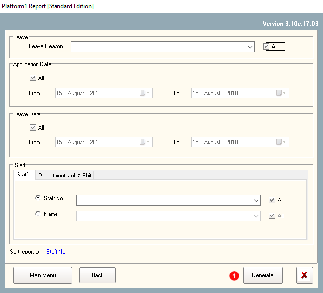

* **If choose 'Leave' option:**
  1. Untick 'All' checkbox.
  2. Click on the Pull Down List Menu and you can choose the type of leave that you would like to be filtered within the report.
  3. Click 'Generate'.

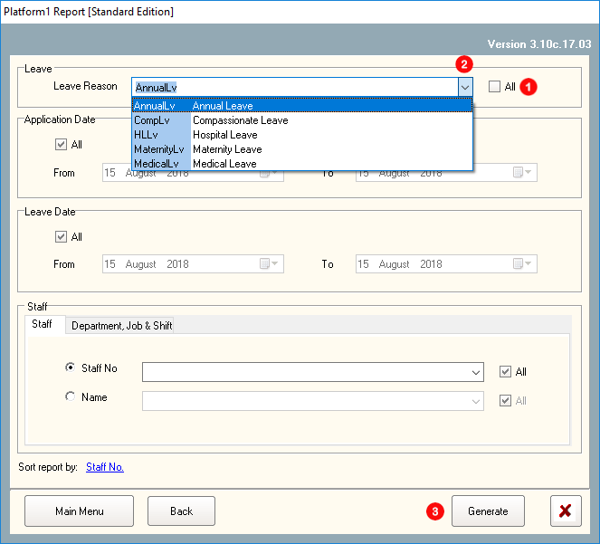

* **If choose 'Leave' option:**
  1. Untick the 'All' checkbox.
  2. Click on the Pull Down List Menu and you can choose the range of dates that you would like to be filtered within the report.
  3. Next, click 'Generate'.

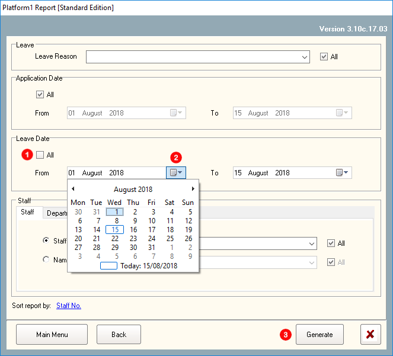

* **If choose 'Staff' option:**
  1. Choose either 'Staff No.' or 'Name'.
  2. Untick 'All' checkbox. Click on the pull down menu and choose the staff either by Staff No or Name.
  3. Next, click 'Generate'.

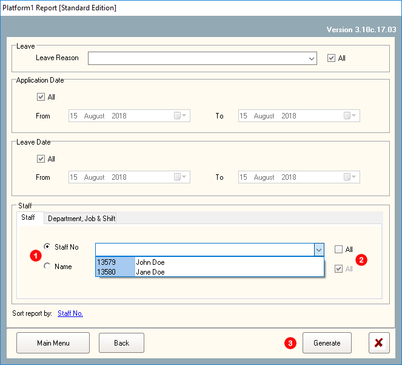



## 9. Normal Shift

This report will highlight and list all normal shift set within the system. 

#### To generate the report:

1. You can choose all OR individual Shifts listed within the list box.
2. Next, click 'Generate'.

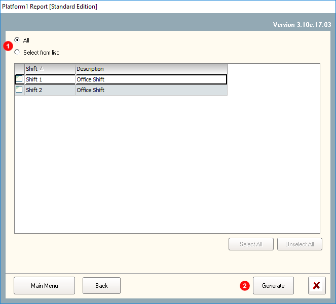



## 10. Day Shift

This report will list all Day Shits details \(Work time, break time, OT period, Deductions, Out Grace period and calculation factors\).

#### To generate the report:

1. You can choose all OR individual Shifts listed within the list box
2. Next, click 'Generate'.

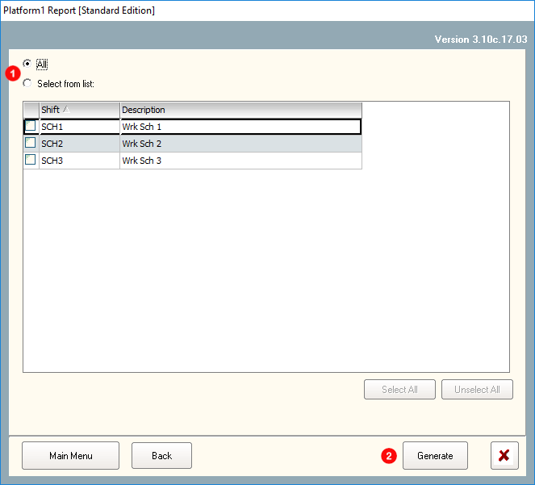



## 11. Shift Roster

This report will highlight the various shifts that had been included into 'Schedule' \(refer to below\).



#### To generate the report:

1. You can choose all OR individual Roster Shifts listed within the list box
2. Next, click 'Generate'.

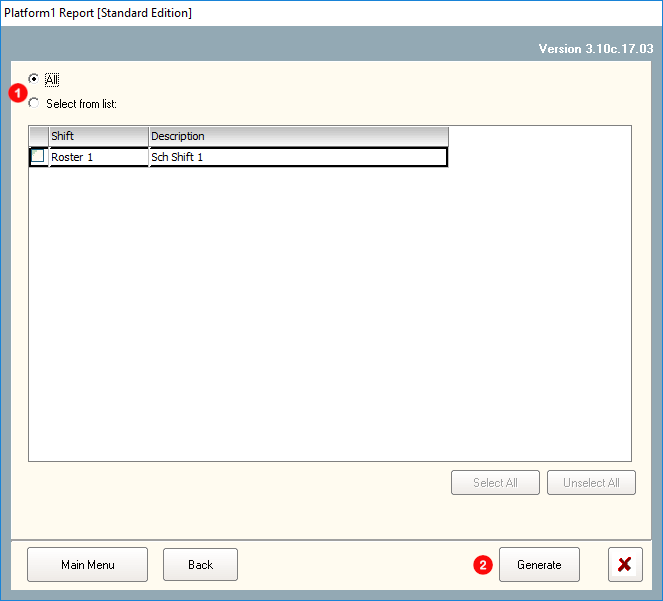



## 12. Staff Shift Roster

This report will highlight the various shift which had been assigned to an employee. 

#### To generate the report:

1. You can choose all OR individual Roster Shifts listed within the list box
2. You can filter the report by 'Department' OR 'Job Position'
3. You can sort the report by 'Staff No', 'Name', 'Department' OR 'Job'
4. Next, click 'Generate'

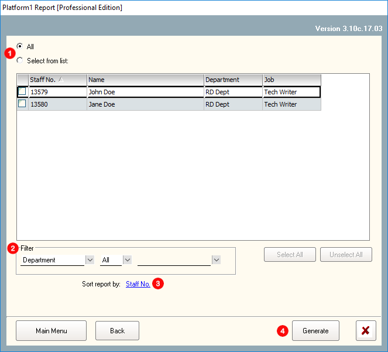



## 13. TA Setting

This report will highlight all Time Attendance Settings \(Advanced\) within the system.

#### To generate the report:

Click on 'TA Setting' and the report will be generated.

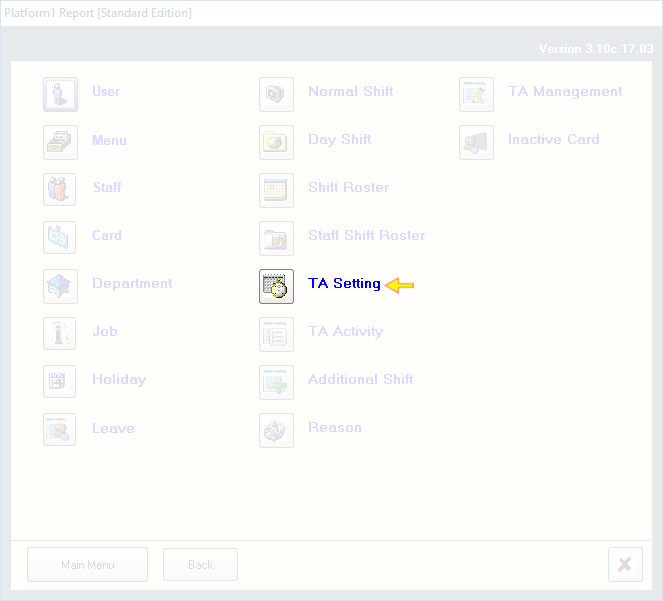



## 14. TA Activity

This report will list details on all TA Activity settings.

#### To generate the report:

1. Click on 'TA Activity' and the report will be generated.

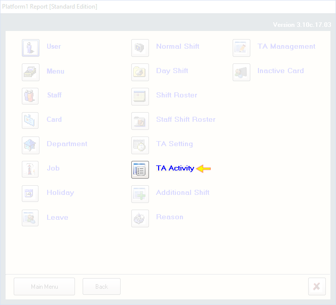



## 15. Additional Shift

This report will list all additional shifts according to dates chosen within the report. 

#### To generate the report:

1. Choose the range of dates that you would like to list all additional shifts.
2. You can either choose all staff OR untick the checkbox to choose specific staffs.
3. Click 'Generate'.

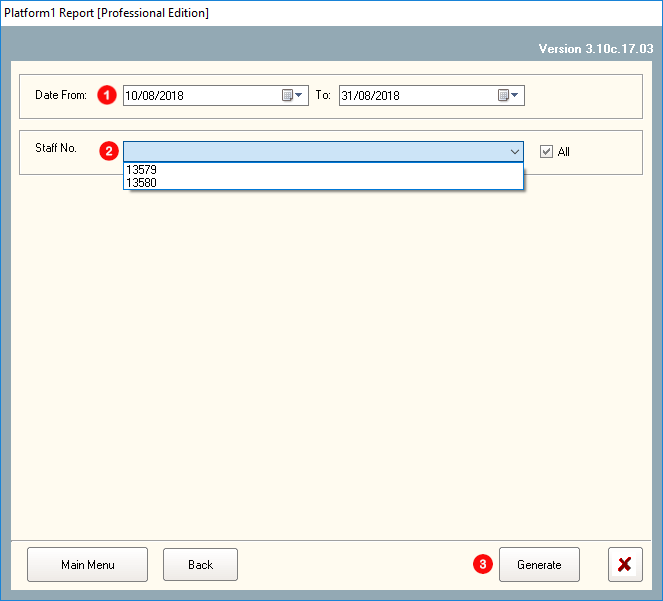



## 16. Reason

This report will list out all Leave application 'Reasons' with its Code, Description and Type generated within the system.

#### To generate the report

1. You can choose all OR individual leave 'Reasons' listed within the list box
2. Next, click 'Generate'

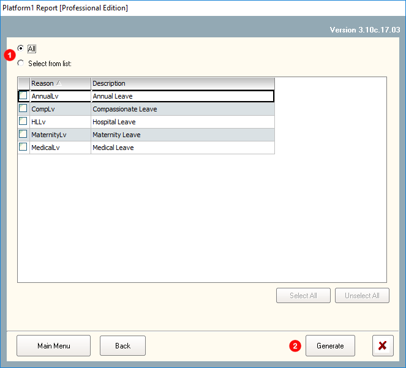



## 17. TA Management

This report will list out all 'authorized transaction' that was approved.

#### To generate the report:

1. You can choose all OR individual leave 'Reasons' listed within the list box
2. Next, click 'Generate'

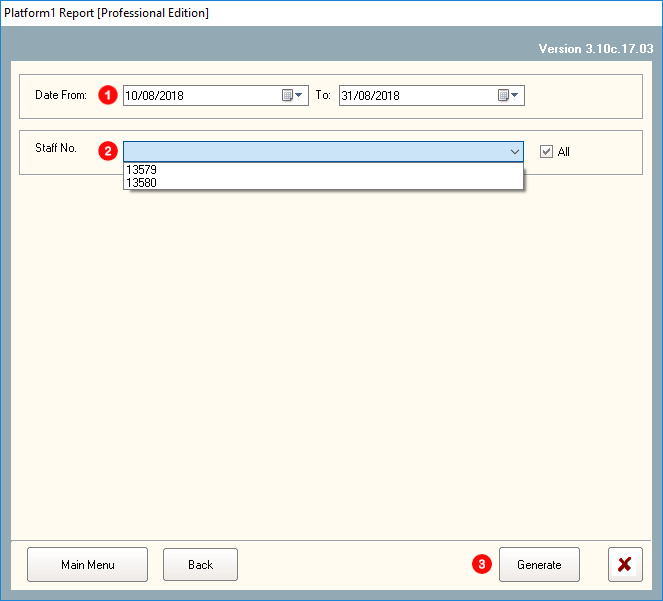



## 18. Inactive Card

This report will list out all cards which is not active.

#### To generate the report:

1. You can choose all OR individual staff listed within the list box.
   * When individual staff is chosen, you can further refine the list by card number OR name of the staff.
2. You can choose all OR individual information listed within the list box.
   * There is a choice of either using department, job or shift to further refine the criteria.
3. The **options section is IMPORTANT**. Here you will define the period \(no of days\) in which the card will be considered as inactive. For example, if you have set the 'Past Days' column 60 days, any cards 'unused' for the past 60 days \(from today\) will be considered as inactive. 
4. Next, click 'Generate'. 

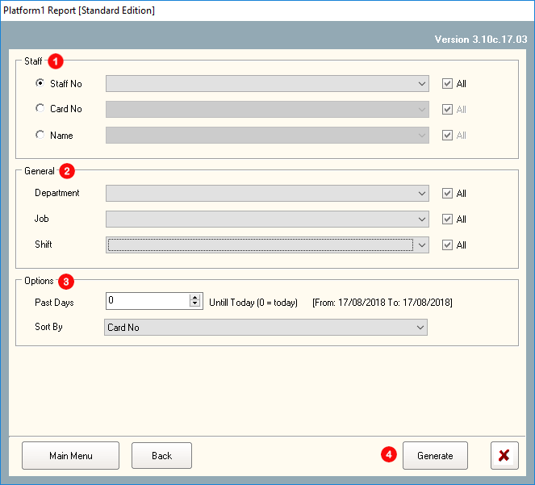



