# System Report

## System Report \(Image\)

## 1. Preferences

This generated report will highlight the latest 'Preferences' setting which is being applied to the system. 

#### To generate the report:



#### Click on the icon 'Preferences' and it will automatically generate the report. 






## 2. Connection

This generated report will show communication methods from Server to Control Panels which is set in the system. 

#### To generate the report: 



#### Click 'Connection'.  




#### You can choose all OR individual connection details listed within the list box. Next, click 'Generate'. 






## 3. Router

This generated report will show the IP Address and details of connected remote devices located away from the server.

#### To generate the report:



#### Click 'Router'.  




#### You can choose all OR individual routers listed within the list box. Next, click 'Generate'. 






## 4. Time Set

This generated report will show all Time Sets in the system.

#### To generate the report:



#### Click 'Time Set'




#### You can choose all OR individual Time Sets listed within the list box. Next, click 'Generate'. 






## 5. Time Zone

This generated report will show all Time Zones in the system.

#### To generate the report:



#### Click 'Time Zone'

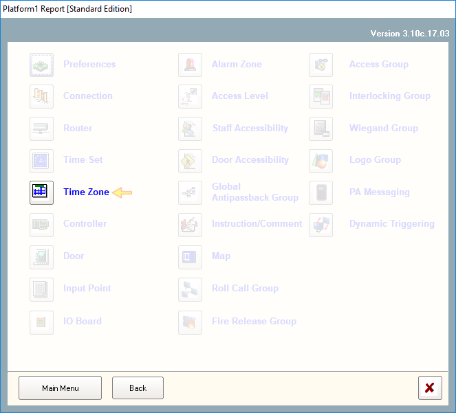



#### You can choose all OR individual Time Zones listed within the list box. Next, click 'Generate'. 






## 6. Controller

This generated report will show all Control Panels connected to the Platform1 Server.

#### To generate the report:



#### Click 'Controller'




#### You can choose all OR individual Control Panels listed within the list box. Next, click 'Generate'. 

_NOTE: To display report details on 'Doors' and 'Alarms' connected to the Control Panel, tick the checkbox for door & alarm._






## 7. Door

This generated report will show all doors in the system.

#### To generate the report:



#### Click 'Door'




#### You can choose all OR individual Doors listed within the list box. Next, click 'Generate'. 






## 8. Input Point

This generated report will show all input points in the system.

#### To generate the report:



#### Click 'Input Point'

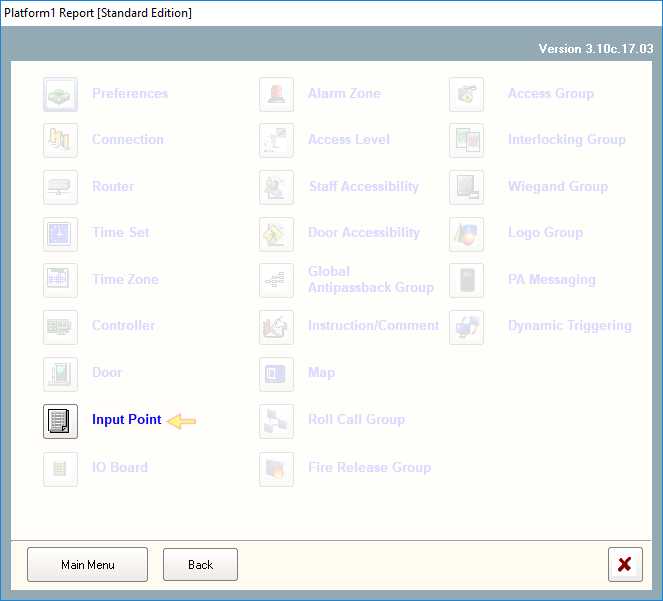



#### You can choose all OR individual input points listed within the list box. Next, click 'Generate'. 

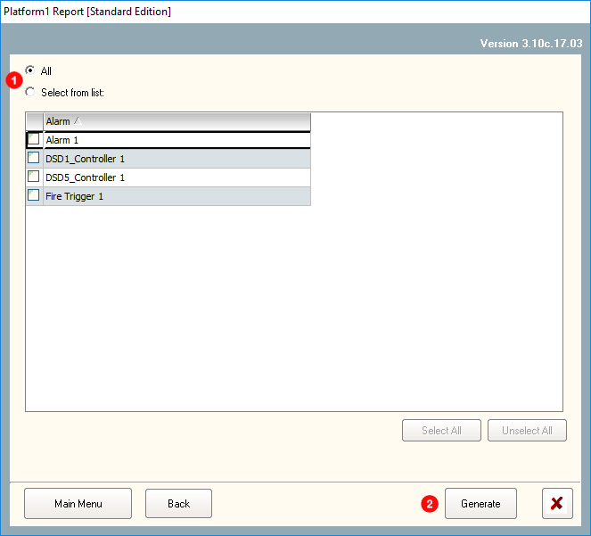





## 9. IO Board

## 10. Alarm Zone

## 11. Access Level

This generated report will show all Access Level in the system.

#### To generate the report:



#### Click 'Access Level'

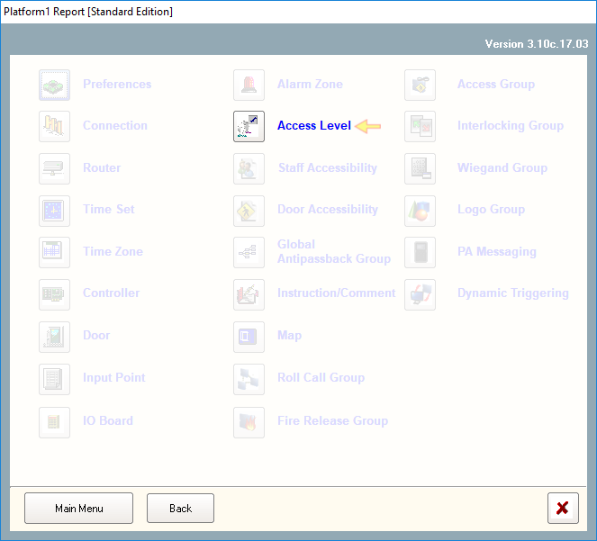



#### You can choose all OR individual Access Levels listed within the list box. Next, click 'Generate'. 

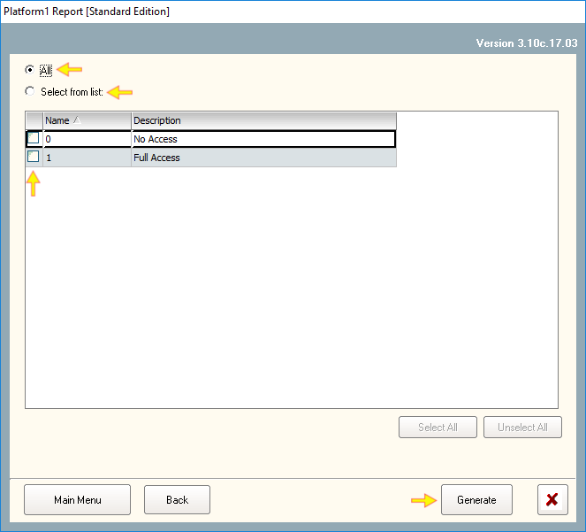





## 12. Staff Accessibility

This generated report will show all staff's accessibility in the premises. This report will highlight details on the doors, lifts and car park accessibility to all staffs as well as the Time Zone governing these access points. 

#### To generate the report:



#### Click 'Staff Accessibility'

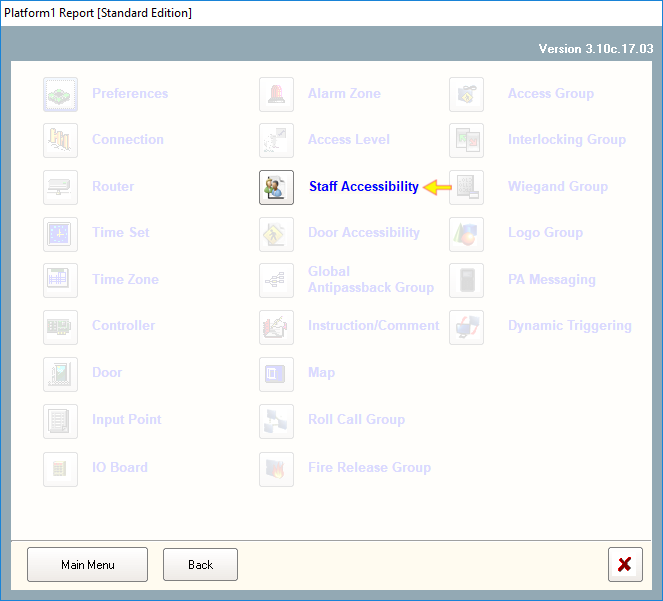



#### You can choose all OR individual staffs listed within the list box. Also, you can choose all doors OR individual doors listed within the list box. Next, click 'Generate'. 

_Note: You can sort the report either by Staff No, Staff Name, Department or Job._

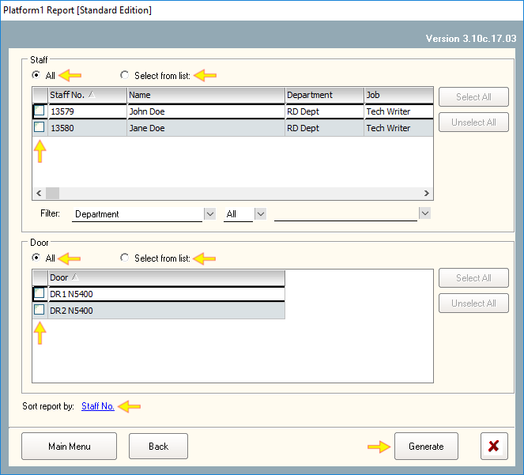





## 13. Door Accessibility

This generated report will show the accessibility of all doors in the premises to staffs. The report will be grouped by doors while each door will contain the list of staffs that possess the necessary credentials to pass through it.

#### To generate the report:



#### Click 'Door Accessibility' 

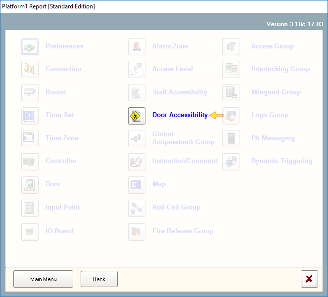



1. **You can choose all OR individual doors listed within the list box.** 
2. **You can choose all staffs OR individual staffs listed within the list box.** 
3. _**\(Option\)You can sort the report either by Staff No, Staff Name, Department or Job within each door.**_ 
4. **Next, click 'Generate'.** 

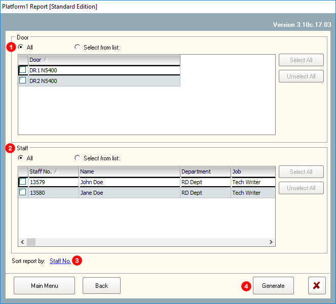





## 14. Instruction/Comment

This generated report will show the full list of alarm codes and its description together with specific Instructions/Comments that you have typed into its field as well as sound files that you have recorded. 

To generate the report:



#### Click 'Instruction/Comment'. 

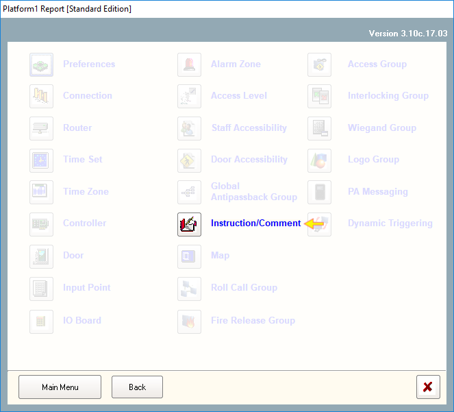



1. **You can choose all OR individual doors listed within the list box.** 
2. **Next, click 'Generate'.** 

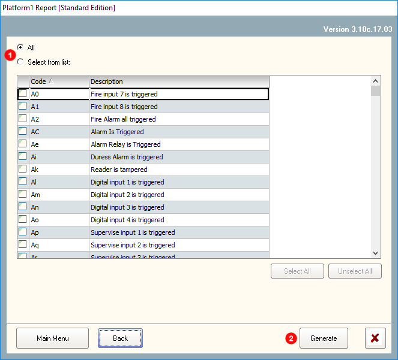





## 15. Map

This generated report will list all maps \(image file\) within the 'Floor Plan' Tab. 

#### To generate the report:



#### Click 'Map'

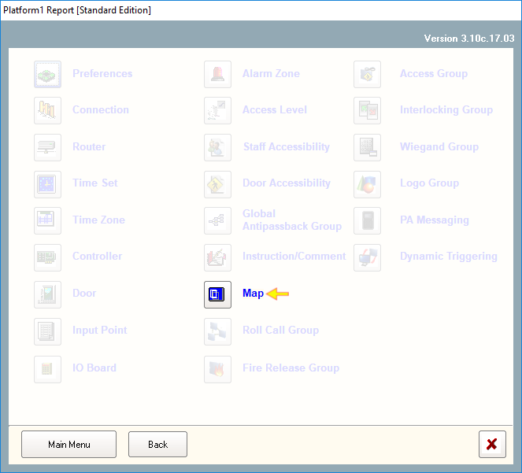



1. **You can choose all OR individual maps listed within the list box.** 
2. **Next, click 'Generate'.** 

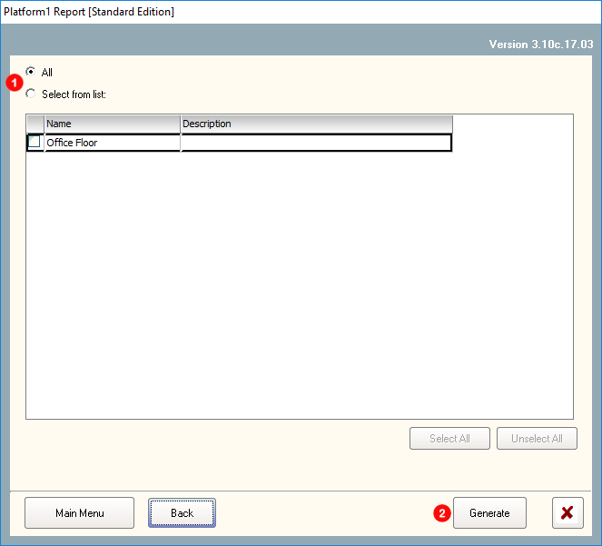





## 16. Roll Call Group

This generated report will list all Roll Call groups created in the system.

#### To generate the report:



#### Click' Roll Call Group' 

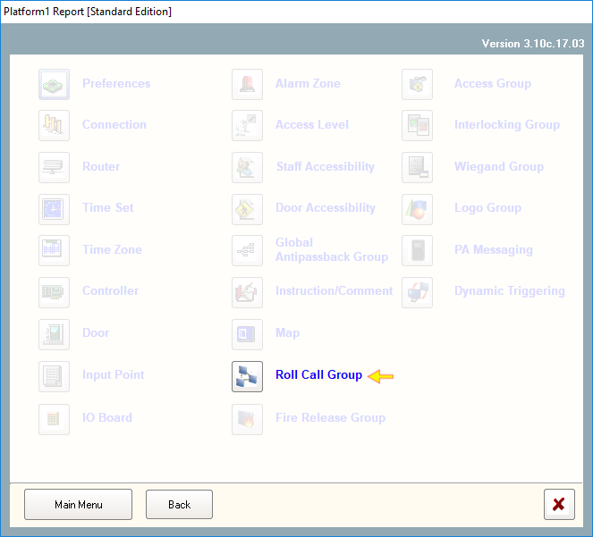



1. **You can choose all OR individual Roll Call groups listed within the list box.** 
2. **Next, click 'Generate'.**






## 17. Fire Release Group

This report will list all Fire Release groups created in the system, together with all doors listed under it. 

#### To generate the report:



#### Click 'Fire Release Group'

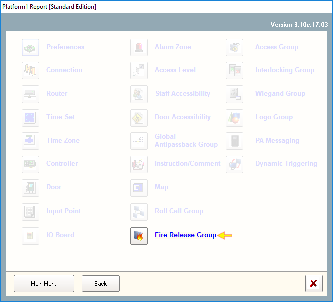



1. **You can choose all OR individual Fire Release groups listed within the list box.** 
2. **Next, click 'Generate'.**

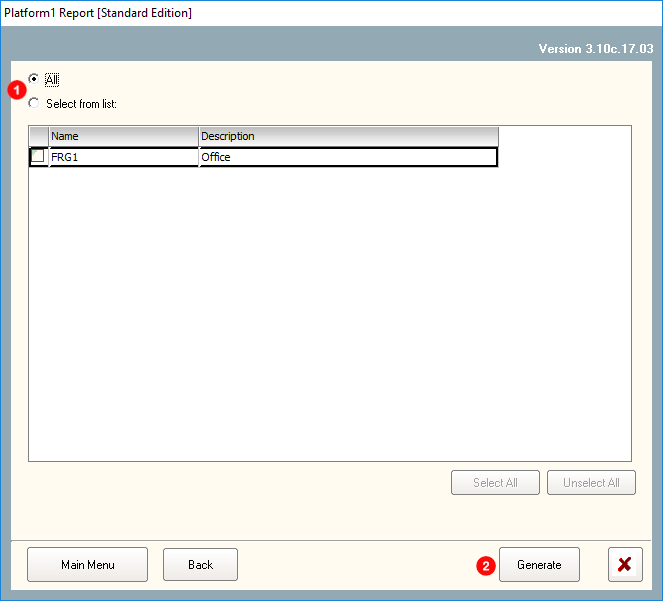





## 18. Access Group

This report will list all Access Groups created in the system and the doors grouped under each Access Group.

#### To generate the report:



#### Click 'Access Group'.

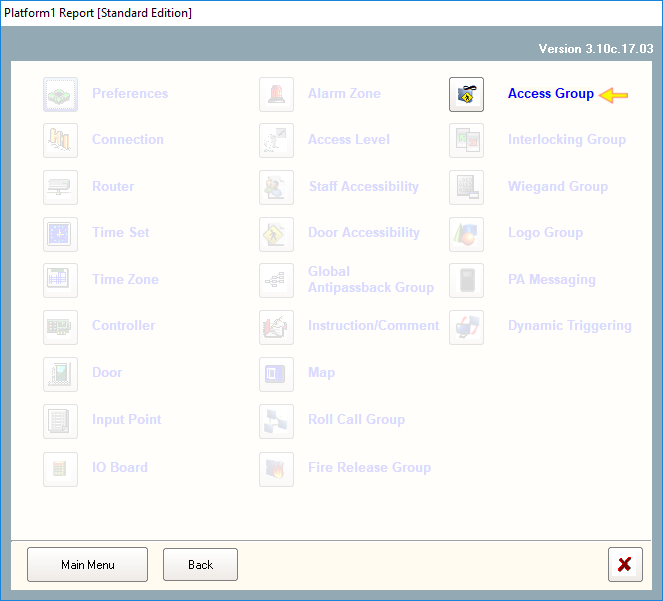



1. **You can choose all OR individual Access Groups listed within the list box.** 
2. **Next, click 'Generate'.**






## 19. Interlocking Group

This report will list Interlocking Groups in the system with the Control Panels assigned to it.

To generate the report:



#### Click 'Interlocking Group'

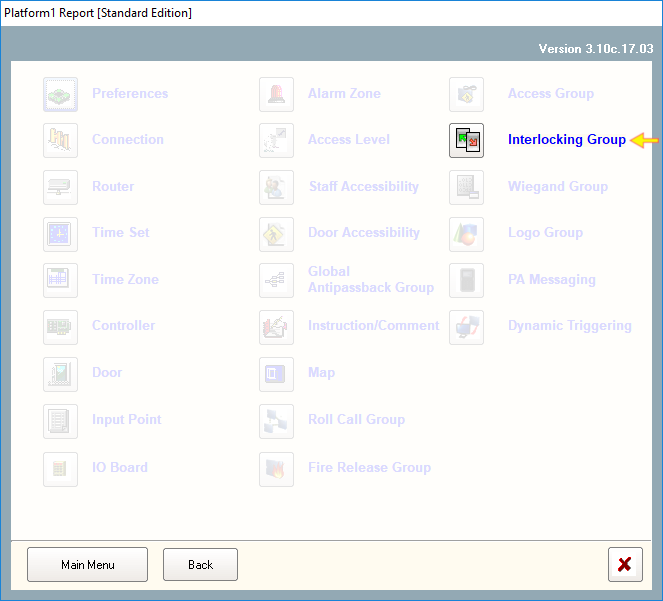



1. **You can choose all OR individual Interlocking Group listed within the list box.** 
2. **Next, click 'Generate'.**

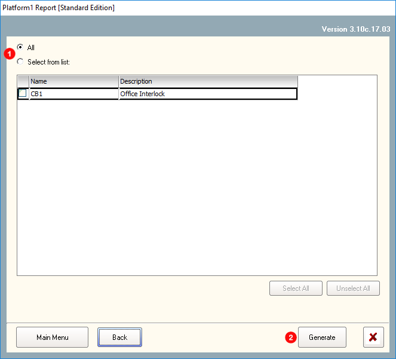





