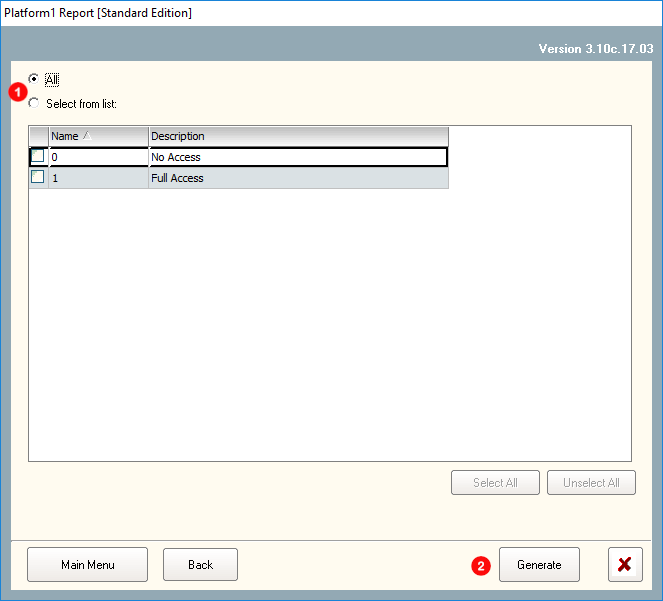
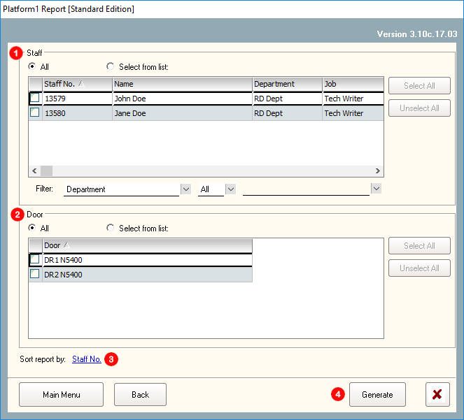

# System Report

## System Report \(Image\)

## 1. Preferences

This report will generate the latest 'Preferences' setting which is applied to the system. The contents generated within this report is linked to 'Preferences' in 'Control Panel Tab'. 

#### To generate the report:



#### Click on the icon 'Preferences' and it will automatically generate the report. 






## 2. Connection

Reports generated will show communication methods from Server to Control Panels which is set in the system. The contents generated within this report are linked to 'Connection' in 'Control Panel Tab'.

#### To generate the report: 



#### Click 'Connection'.  




#### You can choose all OR individual connection details listed within the list box. Next, click 'Generate'. 






## 3. Router

Reports generated will show the IP Address and the details of the connected remote devices where these listed devices are located away from the location of the server and had to be connected remotely. The contents generated within this report is linked to 'Remote Router' in 'Control Panel Tab'.

#### To generate the report:



#### Click 'Router'.  




#### You can choose all OR individual routers listed within the list box. Next, click 'Generate'. 






## 4. Time Set

Reports generated will show all Time Sets which had been created.

#### To generate the report:



#### Click 'Time Set'




#### You can choose all OR individual Time Sets listed within the list box. Next, click 'Generate'. 






## 5. Time Zone

Reports generated will show all Time Sets which had been created.

#### To generate the report:



#### Click 'Time Zone'




#### You can choose all OR individual Time Zones listed within the list box. Next, click 'Generate'. 






## 6. Controller

Reports generated will show all Control Panels connected to the Platform1 Server.

#### To generate the report:



#### Click 'Controller'




#### You can choose all OR individual Control Panels listed within the list box. Next, click 'Generate'. 

_NOTE: To display report details on 'Doors' and 'Alarms' connected to the Control Panel, tick the checkbox for door & alarm._






## 7. Door

Reports generated will show all doors listed within the Control Panel connected to the Platform1 Server.

#### To generate the report:



#### Click 'Door'




#### You can choose all OR individual Doors listed within the list box. Next, click 'Generate'. 






## 8. Input Point

Reports generated will show all input points listed within the Control Panel connected to the Platform1 Server.

#### To generate the report:



#### Click 'Input Point'




#### You can choose all OR individual input points listed within the list box. Next, click 'Generate'. 






## 9. IO Board

## 10. Alarm Zone

## 11. Access Level

Reports generated will show all Access Level listed within the system.

#### To generate the report:



#### Click 'Access Level'




#### You can choose all OR individual Access Levels listed within the list box. Next, click 'Generate'. 






## 12. Staff Accessibility

Reports generated will show all staff's accessibility in the premises. This report will highlight details on the doors, lifts and car park accessibility as well as the Time Zone governing these access points. 

#### To generate the report:



#### Click 'Staff Accessibility'




#### You can choose all OR individual staffs listed within the list box. Also, you can choose all doors OR individual doors listed within the list box. Next, click 'Generate'. 

_Note: You can sort the report either by Staff No, Staff Name, Department or Job._






