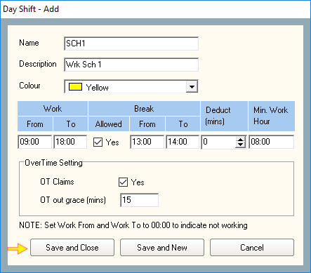

# How to create Roster Shift in Time Attendance

## List of Steps

#### STEP 1: Proceed to Control Panel tab and click ‘Time Attendance’. Next, click on ‘Day Shift’.

#### STEP 2: Click ‘Add’

#### STEP 3: Provide a name and description to the ‘Day Shift’ that you are going to add. You may provide a ‘colour’ to this Day Shift to provide easy visual identification.

#### STEP 4: Key in the ‘Work Time’, ‘Break Time’ and ‘Minimum Work Hour’. If ‘Deduct Minutes’ is applicable, then key in the time period. If there are overtime involved, tick the ‘OT Claims’ checkbox to yes \(refer to Quick Note 1\). 

#### STEP 5: Click 'Save and New' if you would like to create additional Roster Shifts. Otherwise, click ‘Save and Close’.

#### STEP 6: Click 'Close'

#### STEP 7: Return to Control Panel and proceed to click 'Time Attendance'. Next, click ‘Schedule’.

#### STEP 8: Click ‘Add \(F2\)’.

#### STEP 9: Provide a 'Name' and 'Description' for the ‘Shift Roster’ that is to be created.

#### STEP 10: Choose to the month and date\(s\) that you would like to create the roster by either clicking on each of the date OR you can hold the left mouse button down and drag across multiple dates. Once the dates had been highlighted, proceed to ‘Day Shift’ tab and click on the ‘Day Shift’ link.

#### STEP 11: Select the ‘Day Shift’ that you have created. Click ‘Select’ when done. You can clear the selection either by highlighting the dates and press 'Clear Selection' OR you can clear the whole calendar by clicking 'Clear All'. 

#### STEP 12: Click 'Set'. Repeat Step 10 - Step 11 with other dates as required.

#### STEP 13: When all dates had been set, click ‘Save and Close’.

#### STEP 14: Click ‘Close’

#### STEP 15: You will be brought back to the Control Panel. Proceed to the ‘Company’ Menu. Next, click ‘Staff’.

#### STEP 16: List and choose the staff that you would like to allocate the Normal Shift by using Filter View or Classic View. Next click ‘Edit \(F4\)’.

#### STEP 17 & COMPLETE: Under ‘Shift Type’, tick ‘Roster’. Next, click on the pull down menu and choose the Day Shift that the staff belongs to. Once complete, click ‘Accept’. Time Attendance for the particular staff will be active.

## Quick Note

1. There is an additional column ‘Deduct \(mins\)’ where this feature will CONSISTENTLY deduct the total number of hours worked for this staff on whichever the day that this feature is enabled.

