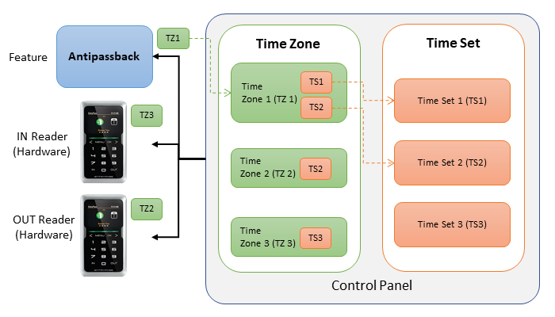
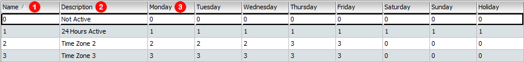
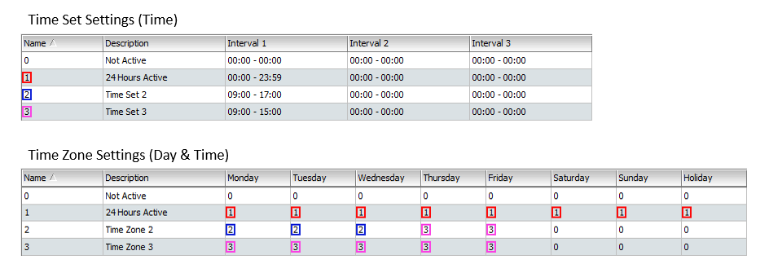

# Time Set & Time Zone

This section will cover the aspects of setting up Time Set and Time Zone. **System Users should take particular note on the importance of having proper settings for Time Set and Time Zone as it will affect operational timing for HARDWARE and FEATURES.** 

## Definition of Time Set and Time Zone

### Time Set

* **Definition: The 'time frame' \(expressed in 'Hours and Minutes'\) for system's operation.** 

### **Time Zone**

* **Definition:** **The '**_**daily**_ **time frame' \(expressed in 'Days' including Holidays and \) for system's operation.** 

## Conceptual Framework of Time Set and Time Zone

Time Set and Time Zone are two important settings within the Entrypass Platform1 Server System, where it will dictate the **'**_**daily**_ **time frame'** for operation on 'Feature' and 'Hardware' connected to the Control Panel. 

* Time Zone: specify operational Day \(Monday to Sunday inc. Holiday\)
* Time Set: specify operational Time \(minutes and hours\)

All 'Features' and 'Hardware' will be assigned and monitored with a Time Zone, by the Control Panel \(Image 1\). Each **Time Zone** \(e.g. TZ1\) will specify the **days** to operate while **within each day**, it will contain references to **Time Set** where it will specify the **time** to operate. 

It is important to note that:


The Control Panel will monitor and operate all Features and Hardware connected **according to the Time Zone assigned to to each Feature or Hardware.** 


In order for systeTo express the above statement in graphical format, refer to table below:

Operation Time

**When a Hardware OR Feature is assigned with Time Zone from Image 2, it's DAILY active operating hours will be 09:00 to 17:00.** 

\*\*\*\*

## Explanation on Time Set and Time Zone parameters

### Time Set Settings

1. **Name:** The name of Time Sets are numerical and automatically assigned when a new Time Set is created.
2. **Description:** This is the column where you can input the description of a newly created Time Set.
3. **Interval:** This column describes '**Time Range'.** The range can start from **00:00 \(12.00am\) to 23:59 \(11.59pm\)** while you can set up to 3 different time ranges' within a single Time Set. 

Time Set comes with two default settings:


* Time Set 0 = Not Active \(default and non-editable within the system\)
* Time Set 1 = 24 Hours Active \(default and non-editable within the system\)
* Time Set 2 and above = User configurable


### Time Zone Settings

1. **Name:** The name of Time Sets are numerical and automatically assigned when a new Time Set is created.
2. **Description:** This is the column where you can input the description of a created Time Set.
3. **Days:** This column describes **'Days' \(expressed in a single week\).** This range starts from **Monday to Sunday AND Public Holidays.** 

Time Zone comes with two default settings:


* Time Zone 0 = Not Active \(default and non-editable within the system\)
* Time Zone 1 = 24 Hours Active \(default and non-editable within the system\)
* Time Zone 2 & above = User configurable


## Infographic Illustration

For illustration, when any Hardware OR Feature that is being assigned with **'Time Zone 2'** parameter, the operating day and time of that Hardware OR Feature will be as follows:


* Mon - Wed: 09:00 - 17:00
* Thu - Fri: 09:00 - 15:00
* Sat, Sun and Public Holiday: Not Active


Similarly, if any Hardware OR Feature that is being assigned with 'Time Zone 1 \(24 Hours Active'\), the operating day and time of that Hardware OR Feature will be 24 hrs everyday, including Saturday, Sunday and Public Holidays.

It is important for you to note that:


"Whenever any **hardware** Time Zone setting is in INACTIVE state, all **features** will not be functional despite its setting is ACTIVE"


## Setting Scenarios

### Scenario 1 \(Hardware Setting only\)

Consider the Time Set \(TS\) & Time Zone \(TZ\) settings below:















#### Infographic:

#### When the above setting is applied to a hardware \(eg. a reader\), any staff using assigned access card would experience the following:

| Hardware / Days | Monday | Tuesday | Wednesday | Thursday | Friday | Saturday | Sunday | Holiday |
| :--- | :--- | :--- | :--- | :--- | :--- | :--- | :--- | :--- |
| Reader | 09:00 - 17:00 | 09:00 - 17:00 | 09:00 - 17:00 | 09:00 - 17:00 | 09:00 - 17:00 | Inactive | Inactive | Inactive |
|  |  |  |  |  |  |  |  |  |

* **Between 9.00am - 5.00pm:** 

  * Reader: Active
  * Result: all staff can pass through the door.

* **Between 5.01pm - 8.59am next day:**

  * Reader: Inactive
  * Result: all staff cannot pass through the door.

* **Saturdays, Sundays and Holidays**
  * Reader: Inactive
  * Result: all staff cannot pass through the door.


**Conclusion: Staff's will not have any access to doors when the reader \(hardware\) is INACTIVE.**


### Scenario 2 \(Hardware with Feature Setting\)

Consider the Time Set & Time Zone settings below:



















#### Infographic

#### When the above setting is applied to a hardware \(eg. a reader\) and feature \(Antipassback\), any staff using the access card would experience the following:

* **Between 9.00am - 3.00pm:**

  * Reader: Active
  * Feature \(Antipassback\): Active
  * Result: door is active and staff can pass through.
  * Staffs cannot pass through \(enter\) the same door without performing 'flashing' out first \(Antipassback feature\). 

* **Between 3.01pm - 5.00pm:** 

  * Reader: Active
  * Feature \(Antipassback\): Inactive
  * Result: door is active and staff can pass through.
  * Staffs can pass through \(enter\) the same door without performing 'flashing' out first \(Antipassback feature turned off\). 

* **Between 5.01pm - 8:59am \(Next Day\):**

  * Reader: Inactive
  * Feature \(Antipassback\): Inactive
  * Result: reader is inactive.
  * Staffs cannot pass through the door.

* **Saturdays, Sundays and Holidays:**
  * Reader: Inactive
  * Feature \(Antipassback\): Inactive
  * Result: reader is inactive.staffs cannot pass through the door.


**Conclusion:** 

1. As long as the hardware \(e.g. reader\) stays ACTIVE, any features will be active as long as its Time Zone setting is similar to hardware \(e.g. reader\). 
2. If the feature Time Zone is 'shorter' \(shorter operating hours\) compared to hardware, the feature will be INACTIVE \(turned off\) like Scenario 2. 
3. If the feature Time Zone setting is 'longer' compared to the hardware \(e.g. reader\), the feature will not work beyond the hardware's Time Zone because the hardware is in INACTIVE state like Scenario 2.


## Quick Notes

**Antipassback Feature:** A system where the card holder would need to perform a complete process by flashing IN and OUT when entering and exiting the door. Refer to the chapter Antipassback for more information.



