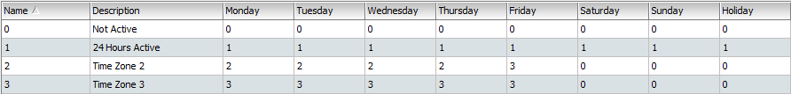

# Time Set & Time Zone

This section will cover the aspects of setting up Time Set and Time Zone. **System Users should take particular note on the importance of having proper settings for Time Set and Time Zone as it will affect operational timing for HARDWARE and FEATURES.** 

## Definition of Time Set and Time Zone

### Time Set

* **Definition: The 'time frame' \(expressed in 'Hours and Minutes'\) for system's operation.** 

### **Time Zone**

* **Definition:** **The '**_**daily**_ **time frame' \(expressed in 'Days' including Holidays and \) for system's operation.** 

## Conceptual Framework of Time Set and Time Zone

Time Set and Time Zone are two important settings within the Entrypass Platform1 Server System, where it will dictate the **'**_**daily**_ **time frame'** for operation on 'Feature' and 'Hardware' connected to the Control Panel. 

* Time Zone: specify operational Day \(Monday to Sunday inc. Holiday\)
* Time Set: specify operational Time \(Time Intervals in minutes and hours\)

All 'Features' and 'Hardware' will be assigned and monitored by the Control Panel \(Image 1\) using Time Zone. Each **Time Zone** \(e.g. TZ1\) will specify the **days** to operate while **within each day**, it will contain a reference to **Time Set** specifying the **time \(in intervals\)** to operate. Therefore, it is important to note that:


The Control Panel will **TURN ON OR OFF**_**,**_ **all Features and Hardware connected according to Time Zone assigned.** 


## Description on Time Set and Time Zone settings

### Time Set Settings

1. **Name:** The name of Time Sets are numerical and automatically assigned when a new Time Set is created.
2. **Description:** This is the column where you can input the description of a newly created Time Set.
3. **Interval:** This column describes '**Time Range'.** The range can start from **00:00 \(12.00am\) to 23:59 \(11.59pm\)** while you can set up to 3 different time ranges' within a single Time Set. 

Time Set comes with the following settings:

| Time Set | Description | Status | Information |
| :--- | :--- | :--- | :--- |
| 0 | Not Active | Default | This is a default setting and not user configurable. **Any day in a Time Zone assigned with this Time Set will render that day 'not active '.**  |
| 1 | 24 Hours Active | Default | This is a default setting and not user configurable. **Any day in a Time Zone assigned with this Time Set will render that day 'active at all times' \(ie. 24 hours a day\).** |
| 2 and above | User Configurable | User Configurable | Time Set settings can only be configured by users from Time Set 2 onward. |

### Time Zone Settings

1. **Name:** The name of Time Sets are numerical and automatically assigned when a new Time Set is created.
2. **Description:** This is the column where you can input the description of a created Time Set.
3. **Days:** This column describes **'Days' \(expressed in a single week\).** This range starts from **Monday to Sunday AND Public Holidays.** 
4. **Time Set:** This section will contain references to Time Set which will dictate the operating hours for the system.

Time Zone comes with the following settings:

| Time Zone | Description | Status | Information |
| :--- | :--- | :--- | :--- |
| 0 | Not Active | Default | This is a default setting and not user configurable. **Any Hardware or Feature assigned with this Time Zone will be rendered 'not active ' \(ie. Turned Off\).**  |
| 1 | 24 Hours Active | Default | This is a default setting and not user configurable. **Any Hardware or Feature assigned with this Time Zone will be rendered 'active at all times' \(ie. 24 hours a day\).** |
| 2 and above | User Configurable | User Configurable | Time Zone settings can only be configured by users from Time Zone 2 onwards. |

## System at Work

This section will demonstrate how Time Zone and Time Set working together to control operation day and time. The following steps will always apply when customising your day and time operational requirements for any Hardware or Feature.


* STEP 1 \(Create Time Set\): Always create the required Time Set in the system and specify operational times.
* STEP 2 \(Create Time Zone\): At the Time Zone section, you will specify what are the operational times for each day within the week.
* STEP 3 \(Assign Time Zone\): Go to any hardware or feature settings to assign the newly created Time Zone to activate or customise its operational day and time.


### Scenario

Consider a hypothetical scenario below for Hardware \(N-Mini2 Reader\) setting and its operation matrix.


N-Mini2 reader operational requirements:

* Operating Days: Monday - Friday \(excluding Saturday, Sunday and Holidays\)
* Operating Time 1: 09:00 - 17:00 \(Monday - Thursday\)
* Operating Time 2: 09:00 - 18:00 \(Friday\)


To achieve the operational requirements above, the Time Set and Time Zone settings will be as following:

#### STEP 1: Create Time Set

A Time Set will allow Time Zone to create a link \(reference\) to Time Set to obtain operational time. In this scenario, there are two different operational times, hence the requirement to create two different sets of Time Set \(Time Set 2 & Time Set 3\). 

The image above will highlight that the operating time had been created under Time Set 2 and Time Set 3. This will later allow Time Zones to be referenced to this Time Set.

#### STEP 2: Create Time Zone

A Time Zone will allow all Hardware and Feature to reference it's operational day and time requirement. Within each day of the Time Zone, there is a Time Set referenced to that day.

From the illustration above, we can see that there are three time sets being linked to a single Time Zone. Therefore we can conclude that the operational day and time frame will be as follows:


Time Zone 2:

* Monday - Thursday: 09:00 - 17:00 \(Time Set 2\)
* Friday: 09:00 - 18:00 \(Time Set 3\)
* Saturday, Sunday and Holiday: Inactive \(Time Set 0\)


#### STEP 3: Assign Time Zone

Now, the Time Zone is ready to be assigned. Just go to any Hardware or Feature settings and begin assigning Time Zones for day and time operational requirements.

## Finer Points on Time Zone assigned to Hardware and Features

**Point 1: Time Zone assigned to Hardware will always precede Time Zone assigned to Features.**

In order to understand Point 1 above, we shall create a hypothetical scenario to further demonstrate how this finer point works.


N-Mini2 reader operational requirements:

* Operating Days: Monday - Friday \(excluding Saturday, Sunday and Holidays\)
* Operating Time 1: 09:00 - 19:00 \(Monday - Wednesday\)
* Operating Time 2: 09:00 - 17:00 \(Thursday - Friday\)

Feature \(Antipassback\) operational requirements:

* Operating Days: Monday - Sunday Including Holidays
* Operating Time: 09:00 - 17:00


Below would be a table highlighting the hardware and feature operation status.


**Conclusion:** 

1. As long as the hardware \(e.g. reader\) stays ACTIVE, any features will be active as long as its Time Zone setting is similar to hardware \(e.g. reader\). 
2. If the feature Time Zone is 'shorter' \(shorter operating hours\) compared to hardware, the feature will be INACTIVE \(turned off\) like Scenario 2. 
3. If the feature Time Zone setting is 'longer' compared to the hardware \(e.g. reader\), the feature will not work beyond the hardware's Time Zone because the hardware is in INACTIVE state like Scenario 2.


#### Point 2: When Time sets overlap with each other between the time intervals, the system will pick the time interval with the longest duration of hours.

## Quick Notes

**Antipassback Feature:** A system where the card holder would need to perform a complete process by flashing IN and OUT when entering and exiting the door. Refer to the chapter Antipassback for more information.



