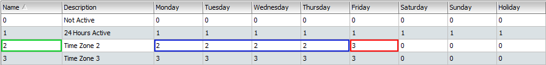

# Time Set & Time Zone

This section will cover the aspects of setting up Time Set and Time Zone. **System Users should take particular note on the importance of having proper settings for Time Set and Time Zone as it will affect operating time for HARDWARE and FEATURES.** 

## Definition of Time Set and Time Zone

### Time Set

* **Definition: The 'time frame' for system's operation.** 
* **Parameter: TIME \(in hours and minutes\)**

### **Time Zone**

* **Definition:** **The '**_**daily**_ **time frame' for system's operation.** 
* **Parameter: DAY \(expressed in week including holiday\) AND TIME \(link to Time Set\)**

## Conceptual Framework of Time Set and Time Zone

Time Set and Time Zone are two important settings within the Entrypass Platform1 Server System, where it will dictate the **'**_**daily**_ **operating** **time frame'** for 'connected Hardware and Feature' to the Control Panel. To further explain on how DAY and TIME can be controlled, we can see from Image 1 that Time Zone will be responsible in dictating the Day for operation while within each Day, there will be a reference to Time Set to control the operating time range FOR THAT DAY \(refer to Image 2\). 

1. **Time Zone:** Each line across represents a single Time Zone where it will define the operating days in the week \(Monday to Sunday\) including holidays.
2. **Time Set:** Within each day, a Time Set will be 'chosen' to define the operating time for that particular day.
3. **Time Interval:** This is where you set the operating time range.

Generally, **all connected Hardware and Feature will be assigned with a Time Zone** so that their daily operating time frame can be defined and controlled \(Image 3\). To illustrate how a Hardware OR Feature can be controlled, we shall take a look at the IN Reader \(Image 3\) which had been assigned with Time Zone 2. It's daily operating time frame will be as follows:

| Days \(Time Zone 1\) | Time |
| :--- | :--- |
| Monday to Wednesday | 09:00 - 17:00 \(Time Set 2\) |
| Thursday to Friday | 09:00 - 19:00 \(Time Set 1\) |
| Saturday, Sunday and Holiday | Not Active \(Time Set 0\)\* |

The table above demonstrates how Time Set and Time Zone working together to control the operational day and time frame of any Hardware or Feature. The reader will follow the day and time indicated above for Monday to Friday however when it comes to Saturday, Sunday and Holidays, the reader will not be active where in this instance, staff will be denied access. 

**\(\*\) Please refer to the topic 'Understanding Time Set and Time Zone settings.**

## Steps in Customising Day and Time Operation 

The following steps will always apply when customising your day and time operational requirements for any Hardware or Feature.

**STEP 1 \(Create Time Set\):** Always create the required Time Set in the system and specify operational times. 

**STEP 2 \(Create Time Zone\):** At the Time Zone section, you will specify what are the operational times for each day within the week.

**STEP 3 \(Assign Time Zone\):** Go to any hardware or feature settings to assign the newly created Time Zone to activate or customise its day and time operation.

To understand how these steps work, refer to the section **'System at Work'**.

## Understanding Time Set and Time Zone settings

### Time Set Settings

1. **Name:** The name of Time Sets are numerical and automatically assigned when a new Time Set is created.
2. **Description:** This is the column where you can input the description for a newly created Time Set.
3. **Interval:** This column describes '**Time Range'.** The range can start from **00:00 \(12.00am\) to 23:59 \(11.59pm\)** while you can set up to 3 different time range in a Time Set. 

Time Set comes with the following settings:

| Time Set | Description | Status | Information |
| :--- | :--- | :--- | :--- |
| 0 | Not Active | Default | This is a default setting and not user configurable. **Any day in a Time Zone assigned with this Time Set will render that day 'not active '.**  |
| 1 | 24 Hours Active | Default | This is a default setting and not user configurable. **Any day in a Time Zone assigned with this Time Set will render that day 'active at all times' \(ie. 24 hours a day\).** |
| 2 and above | User Configurable | User Configurable | Time Set settings can only be configured by users from Time Set 2 onward. |

### Time Zone Settings

1. **Name:** The name of Time Zones are numerical and automatically assigned when a new Time Set is created.
2. **Description:** This is the column where you can input the description of a created Time Zone.
3. **Days:** This column describes **'Days' \(expressed in a single week\).** This range starts from **Monday to Sunday AND Public Holidays.** 
4. **Time Set:** This section will contain references to Time Set which will dictate the operating hours for the system.

Time Zone comes with the following settings:

| Time Zone | Description | Status | Information |
| :--- | :--- | :--- | :--- |
| 0 | Not Active | Default | This is a default setting and not user configurable. **Any Hardware or Feature assigned with this Time Zone will be rendered 'not active ' \(ie. Turned Off\).**  |
| 1 | 24 Hours Active | Default | This is a default setting and not user configurable. **Any Hardware or Feature assigned with this Time Zone will be rendered 'active at all times' \(ie. 24 hours a day\).** |
| 2 and above | User Configurable | User Configurable | Time Zone settings can only be configured by users from Time Zone 2 onwards. |

## System at Work

This section will demonstrate how Time Zone and Time Set work together using the system's actual settings. 

### Scenario

Consider a hypothetical scenario below for Hardware \(N-Mini2 Reader\) setting and its operation matrix.


N-Mini2 reader operational requirements:

* Operating Days: Monday - Friday \(excluding Saturday, Sunday and Holidays\)
* Operating Time 1: 09:00 - 17:00 \(Monday - Thursday\)
* Operating Time 2: 09:00 - 18:00 \(Friday\)


To achieve the operational requirements above, the Time Set and Time Zone settings will be as following:

#### STEP 1: Create Time Set

In this scenario, there are two different operational times, hence the requirement to create two different sets of Time Set \(Time Set 2 & Time Set 3\). 

The image above will highlight that the operating time had been created under Time Set 2 and Time Set 3. This will later allow Time Zones to be referenced to this Time Set.

#### STEP 2: Create Time Zone

A Time Zone for the scenario had been created under Time Zone 2 with the relevant Time Sets applied to it \(refer to image above\). From the image above we can see that: 

* Monday to Thursday - Assigned with Time Set 2 \(09:00 - 17:00\)
* Friday - Assigned with Time Set 3 \(09:00 - 18:00\)
* Saturday, Sunday and Holiday: Time Set 0 \(Not Active\)

#### STEP 3: Assign Time Zone

Now, the Time Zone is ready to be assigned. Just go to any Hardware or Feature settings and begin assigning Time Zones for day and time operational requirements.

## Finer Points on Time Zone

**Point 1: Time Zone assigned to Hardware will always precede Time Zone assigned to Features.**

In order to understand Point 1 above, we shall create a hypothetical scenario to further demonstrate how this finer point works.


N-Mini2 reader operational requirements:

* Operating Days: Monday - Friday \(excluding Saturday, Sunday and Holidays\)
* Operating Time 1: 09:00 - 19:00 \(Monday - Wednesday\)
* Operating Time 2: 09:00 - 17:00 \(Thursday - Friday\)

Feature \(Antipassback\) operational day and time frame:

* Operating Days: Monday - Sunday Including Holidays
* Operating Time: 09:00 - 19:00


Below would be a table highlighting the hardware and feature operation status.

With reference to the table above, we can see that:

1. On Monday to Wednesdays, both Reader \(N-Mini 2\) and Feature \(Antipassback\) will be active.
2. On Thursday to Friday, both Reader \(N-Mini 2\) and Feature \(Antipassback\) will be active up to 17:00. Thereafter, the reader will not be active however, 

#### 

#### 

#### Point 2: When Time Sets overlap with each other between the time intervals, the system will pick the time interval with the longest duration of hours.

## Quick Notes

**Antipassback Feature:** A system where the card holder would need to perform a complete process by flashing IN and OUT when entering and exiting the door. Refer to the chapter Antipassback for more information.



