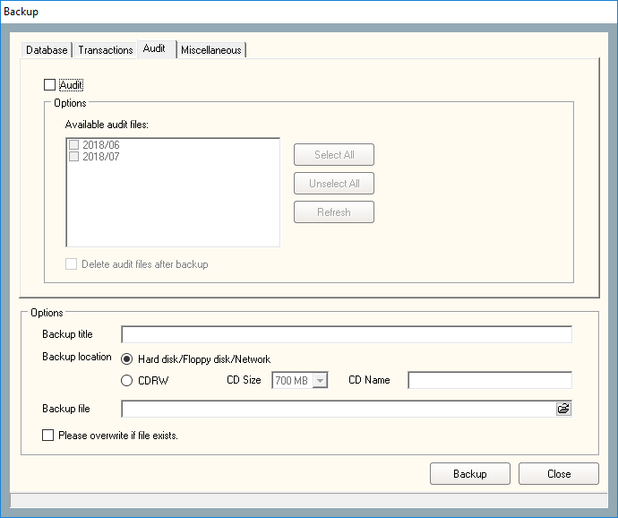

# How to configure Time Zone

## List of Steps

#### STEP 1: Proceed to **‘Control Panel Tab’** and click on the icon **‘Time Zone’** to continue.

#### STEP 2: Click **‘Add \(F2\)’** to continue adding new Time Zone into the system.

#### STEP 3

1. Proceed to key in the description of the Time Zone. 
2. Click on the link to fill in the **‘Time-Set’**. 
3. Click **‘Save and Close’** when done.

## Complete

A new Time Zone will appear from the Time Zone list. Once Save and Close is pressed, the system will send the information required to the control panel.

