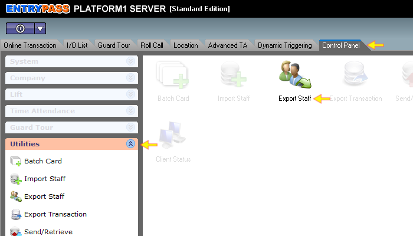

# How to export staff data

## List of Steps

#### STEP 1: Proceed to ‘Control Panel Tab’ and click on ‘Utilities’ Menu. Click ‘Export Staff’.

#### STEP 2: On the ‘Staff’ section under the ‘Staff’ Tab, you will be presented with options to export staff data. Below would be a brief explanation on the options available. 




This section will allow you to export data by either:

1. **Staff No**: This is where you can export individual staff \(by untick 'All' checkbox\) by their assigned staff number.
2. **Card No**: This is where you can export individual staff \(by untick 'All' checkbox\) by their assigned Access Card number.
3. **Name**: This is where you can export individual staff \(by untick 'All' checkbox\) by their name.




This section will allow you to export data by **department** \(by untick 'All' checkbox\) within an organisation.




This section will allow you to export data by **job title** \(by untick 'All' checkbox\) within an organisation.




This section will allow you to export data by **working shifts** \(by untick 'All' checkbox\) within an organisation.



#### STEP 3: On ‘Fields Available’ section, click on the ‘Check’ mark if you would like to export all data fields OR tick on the individual check boxes if you would like to individual data to be exported.

#### STEP 4: Under the ‘Options – Export Format’ section, you can choose either to export the data in Text, MS Excel or CSV format.




#### 1: If there is no requirement to change the Delimiter, leave this section as it is. Proceed to assign an export path by clicking on the ‘Open Folder’ icon.

#### 2: Locate OR create a folder that you would like to export the file into. By default, the file name will be ‘Export’ and you can rename the file if you wish to do so. Click 'Open'.

#### 3. By default, _Single Line output format_ \(data written in horizontal format\) will be the default choice. Untick this checkbox if you would like the data to be written in vertical format. The _fixed field length_ is to specify the data within the file to be in a fixed position. Tick the checkbox if there is such requirement. 

#### 4. At this juncture, if there are no further requirements to further change parameters, click 'Export'. If further changes are necessary, proceed to STEP 5.



STEP I: \(Export by MS Excel File\) Locate OR create a folder that you would like to export the file into. By default, the file name will be ‘Export’ and you can rename the file if you wish to do so.

STEP II: \(Export by MS Excel File\) Tick this checkbox to include ‘Titles’ in the data that is going to be exported.



STEP I: \(Export by CSV File\): Locate OR create a folder that you would like to export the file into. By default, the file name will be ‘Export’ and you can rename the file if you wish to do so.

STEP II: \(Export by CSV File\): Tick this checkbox to include ‘Titles’ in the data that is going to be exported.

STEP III: \(Export by CSV File\): You can choose to have all the fields to be exported as text type. Leave this section unchecked if there are no such requirements.



#### 

#### STEP 5: In the ‘Options – Others’ tab, you can set the format and also the separator for date appearing in the export data.

#### STEP 6: Untick the checkbox ‘Include extension for export Photo File Name’ if you do not want to have the ‘FULL’ file extension name listed in the export data. This feature is enabled by default. 

#### STEP 7: Tick ‘Copy photo file to’ if you would like to export staffs’ photo into a folder. Locate OR create a folder that you would like to export the file into. By default, the file name will be ‘Export’ and you can rename the file if you wish to do so.

#### STEP 8: Tick ‘Use Staff No as photo file name’ if you would like to replace the photo file names \(that is to be exported\) with staff numbers.

#### STEP 9: You can change the Access Group Delimiter within this column. If there are no requirements to change the delimiter, leave this section unchanged.

#### STEP 10 & COMPLETE: Once all required parameters had been chosen, Click ‘Export’.

